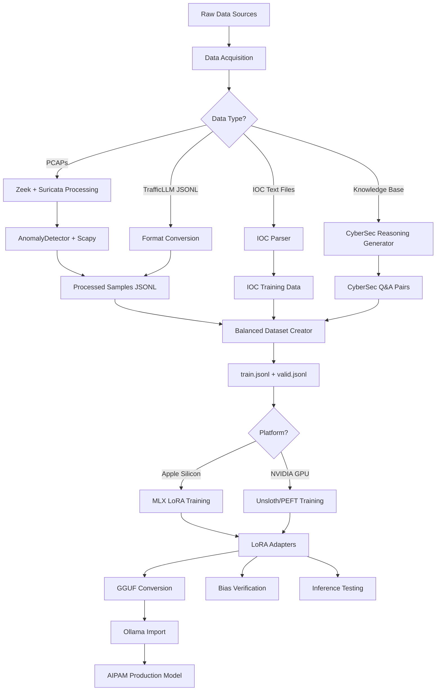

# AIPAM Fine-Tuning Pipeline — Technical Paper v2

> **Document Version:** 2.0  
> **Date:** 15 February 2026  
> **Author:** AIPAM Engineering  
> **Classification:** Internal Technical Reference

---

## Table of Contents

1. [Executive Summary](#1-executive-summary)
2. [Architecture Overview](#2-architecture-overview)
3. [Pipeline Logical Flow](#3-pipeline-logical-flow)
4. [Data Acquisition Layer](#4-data-acquisition-layer)
5. [Data Processing Layer](#5-data-processing-layer)
6. [Dataset Generation Layer](#6-dataset-generation-layer)
7. [Training Layer](#7-training-layer)
8. [Model Export & Deployment Layer](#8-model-export--deployment-layer)
9. [Verification & Bias Detection Layer](#9-verification--bias-detection-layer)
10. [Database & Artifact Structure](#10-database--artifact-structure)
11. [Input/Output Schema Contracts](#11-inputoutput-schema-contracts)
12. [Dataflow Transactions](#12-dataflow-transactions)
13. [LoRA Version History](#13-lora-version-history)
14. [Appendix: File Reference](#appendix-file-reference)

---

## 1. Executive Summary

AIPAM implements a **full end-to-end fine-tuning pipeline** for training Llama 3.1 8B on network traffic analysis and cybersecurity forensics. The pipeline transforms raw PCAP files and cybersecurity knowledge bases into LoRA-adapted language models optimised for:

- **Malware traffic classification** (50+ malware families)
- **Zero-day / anomalous threat detection** with chain-of-thought reasoning
- **MITRE ATT&CK technique mapping**
- **Forensic incident response** recommendations

The system supports dual hardware targets:

| Platform | Framework | Hardware | Script |
|----------|-----------|----------|--------|
| Apple Silicon (M1/M2/M3) | MLX + mlx-lm | 8–32 GB unified memory | `finetune_mlx.py` |
| NVIDIA GPU | Unsloth + PEFT/TRL | 16+ GB VRAM (CUDA 11.8+) | `finetune_llama.py`, `train_cuda.py` |

The pipeline has evolved through **five LoRA versions** (v1→v5), each refining classification accuracy, reducing bias, and adding forensic reasoning capabilities.

---

## 2. Architecture Overview

```
┌───────────────────────────────────────────────────────────────────────────────┐
│                      AIPAM FINE-TUNING ARCHITECTURE                          │
├───────────────────────────────────────────────────────────────────────────────┤
│                                                                               │
│  ┌─────────────────────────────────────────────────────────────────────────┐  │
│  │                     DATA ACQUISITION LAYER                              │  │
│  │  ┌──────────────┐  ┌──────────────────┐  ┌──────────────────────────┐  │  │
│  │  │ TrafficLLM   │  │ Malware-Traffic  │  │ AIPAM Benchmark PCAPs   │  │  │
│  │  │ Google Drive  │  │ IOC Files (.txt) │  │ (46 samples)            │  │  │
│  │  └──────┬───────┘  └────────┬─────────┘  └────────────┬─────────────┘  │  │
│  └─────────┼───────────────────┼─────────────────────────┼─────────────────┘  │
│            │                   │                         │                    │
│  ┌─────────▼───────────────────▼─────────────────────────▼─────────────────┐  │
│  │                     DATA PROCESSING LAYER                               │  │
│  │  ┌──────────────┐  ┌──────────────────┐  ┌──────────────────────────┐  │  │
│  │  │ Zeek Parser  │  │ Suricata Alerts  │  │ Scapy Packet Extraction │  │  │
│  │  │ (conn.log)   │  │ (eve.json)       │  │ (raw bytes/hex)         │  │  │
│  │  └──────┬───────┘  └────────┬─────────┘  └────────────┬─────────────┘  │  │
│  │         │                   │                         │                 │  │
│  │         └───────────────────┼─────────────────────────┘                 │  │
│  │                             ▼                                           │  │
│  │              ┌──────────────────────────┐                               │  │
│  │              │ AIPAM AnomalyDetector    │                               │  │
│  │              │ (Host Aggregation +      │                               │  │
│  │              │  Forensic Heuristics)    │                               │  │
│  │              └────────────┬─────────────┘                               │  │
│  └───────────────────────────┼──────────────────────────────────────────────┘  │
│                              │                                                │
│  ┌───────────────────────────▼──────────────────────────────────────────────┐  │
│  │                     DATASET GENERATION LAYER                            │  │
│  │  ┌──────────────────────┐  ┌───────────────────┐  ┌─────────────────┐  │  │
│  │  │ ChatML Formatter     │  │ CyberSec Reasoning│  │ Zero-Day CoT   │  │  │
│  │  │ (System/User/Assist) │  │ (MITRE Q&A)       │  │ (Synthetic)    │  │  │
│  │  └──────────┬───────────┘  └─────────┬─────────┘  └───────┬─────────┘  │  │
│  │             └────────────────────────┬┘                    │            │  │
│  │                                      ▼                     │            │  │
│  │              ┌────────────────────────────────────┐        │            │  │
│  │              │ Balanced Dataset Creator            │◀───────┘            │  │
│  │              │ (Class-balanced train/valid split)  │                     │  │
│  │              └────────────────┬───────────────────┘                     │  │
│  └───────────────────────────────┼──────────────────────────────────────────┘  │
│                                  │                                            │
│  ┌───────────────────────────────▼──────────────────────────────────────────┐  │
│  │                        TRAINING LAYER                                   │  │
│  │  ┌─────────────────────┐          ┌─────────────────────────────────┐   │  │
│  │  │ MLX LoRA (Apple)    │          │ Unsloth/PEFT LoRA (NVIDIA)     │   │  │
│  │  │ finetune_mlx.py     │          │ finetune_llama.py              │   │  │
│  │  │                     │          │ train_cuda.py / train_v4.py    │   │  │
│  │  └─────────┬───────────┘          └──────────────┬──────────────────┘   │  │
│  └────────────┼─────────────────────────────────────┼──────────────────────┘  │
│               │                                     │                        │
│  ┌────────────▼─────────────────────────────────────▼──────────────────────┐  │
│  │                   MODEL EXPORT & DEPLOYMENT LAYER                       │  │
│  │  ┌───────────────────┐  ┌─────────────────┐  ┌──────────────────────┐  │  │
│  │  │ MLX→GGUF Convert  │  │ Unsloth→GGUF    │  │ Ollama Modelfile    │  │  │
│  │  │ (3-step fusion)   │  │ (direct export) │  │ + ollama create     │  │  │
│  │  └───────────────────┘  └─────────────────┘  └──────────────────────┘  │  │
│  └─────────────────────────────────────────────────────────────────────────┘  │
│                                                                               │
│  ┌─────────────────────────────────────────────────────────────────────────┐  │
│  │                   VERIFICATION & BIAS DETECTION LAYER                   │  │
│  │  ┌───────────────────┐  ┌─────────────────┐  ┌──────────────────────┐  │  │
│  │  │ test_model.py     │  │ verify_model_   │  │ Benchmark Inference  │  │  │
│  │  │ (MLX inference)   │  │ bias.py         │  │ (benchmark/)         │  │  │
│  │  └───────────────────┘  └─────────────────┘  └──────────────────────┘  │  │
│  └─────────────────────────────────────────────────────────────────────────┘  │
└───────────────────────────────────────────────────────────────────────────────┘
```

---

## 3. Pipeline Logical Flow

The fine-tuning pipeline follows a strict sequential flow with parallel dataset augmentation tracks:



### Step-by-Step Execution Order

| Step | Script | Purpose |
|------|--------|---------|
| 1 | `download_training_data.py --download` | Clone TrafficLLM repo, download datasets from Google Drive |
| 2 | `download_training_data.py --convert` | Convert TrafficLLM JSONL → AIPAM format |
| 3 | `process_training_data.py` | Process raw PCAPs through Zeek/Suricata/Scapy pipeline |
| 4 | `create_finetuning_dataset.py` | Create ChatML training dataset from processed samples |
| 4a | `create_cybersec_reasoning_dataset.py` | Generate MITRE/malware/scenario Q&A training data |
| 4b | `parse_ioc_to_training.py` | Convert IOC text files into training samples |
| 4c | `create_zero_day_dataset.py` | Generate zero-day CoT reasoning training examples |
| 4d | `add_benchmark_to_training.py` | Add benchmark PCAP packets to training data |
| 5 | `create_balanced_dataset.py` | Balance all dataset sources by class, split train/valid |
| 6 | `finetune_mlx.py` or `finetune_llama.py` | Execute LoRA fine-tuning |
| 7 | `convert_mlx_to_gguf.py` (MLX only) | Fuse adapters + convert to GGUF |
| 8 | `import_to_ollama.sh` | Create Ollama model with Modelfile |
| 9 | `verify_model_bias.py` | Verify per-class accuracy and bias |
| 10 | `test_model.py` | Run inference tests against known samples |

---

## 4. Data Acquisition Layer

### 4.1 TrafficLLM Datasets

**Script:** [`download_training_data.py`](file:///Users/vinsoncornejo/AIPAM/finetuning/download_training_data.py)

Downloads pre-processed traffic datasets from TrafficLLM's Google Drive (≈500 MB total):

| Dataset | Task Code | Samples | Type | Description |
|---------|-----------|---------|------|-------------|
| USTC-TFC-2016 | MTD | 50.7K | Malware | 10 malware families + 10 normal apps |
| ISCX-Botnet-2014 | BND | 25K | Botnet | Botnet C2 traffic |
| CSIC-2010 | WAD | 34.5K | Web Attack | SQL injection, XSS, etc. |
| DAPT-2020 | AAD | 10K | APT | Advanced persistent threats |
| ISCX-VPN-2016 | EVD | 64.8K | VPN | Encrypted VPN detection |
| ISCX-Tor-2016 | TBD | 40K | Tor | Tor network traffic |

**Input:** Google Drive folder ID / `gdown` API  
**Output:** `data/trafficllm_datasets/` (JSONL files per dataset)

### 4.2 IOC Intelligence Files

**Script:** [`parse_ioc_to_training.py`](file:///Users/vinsoncornejo/AIPAM/finetuning/aipam_gpu_training/parse_ioc_to_training.py)

Parses malware-traffic-analysis.net IOC text files and generates training Q&A pairs. Covers 14 malware families with MITRE mappings including:

- **Stealers:** Lumma Stealer, StealC, Vidar, MassLogger
- **RATs:** Venom RAT, Remcos RAT, NetSupport RAT
- **Loaders:** GuLoader, Astaroth/Guildma
- **TDS/Social Engineering:** KongTuke, SmartApeSG, ClickFix, ClearFake

### 4.3 Benchmark PCAPs

**Script:** [`add_benchmark_to_training.py`](file:///Users/vinsoncornejo/AIPAM/finetuning/add_benchmark_to_training.py)

Processes 46 benchmark PCAPs from `benchmark/manifests/available_benchmark.json`, extracting up to 100 packets per PCAP using Scapy. Generates per-packet training samples with full protocol field extraction.

---

## 5. Data Processing Layer

### 5.1 PCAP Processing Pipeline

**Script:** [`process_training_data.py`](file:///Users/vinsoncornejo/AIPAM/finetuning/process_training_data.py)

This is the **core processing engine** that transforms raw PCAPs into structured training samples using the exact same pipeline as AIPAM's production analysis:

```
Raw PCAP
  │
  ├─── Zeek ────────► conn.log (JSON) ──► parse_zeek_conn() ──► Flow objects
  │                   dns.log (JSON)  ──► parse_zeek_dns()   ──► DNS queries
  │
  ├─── Suricata ────► eve.json ──────────► parse_suricata_eve() ──► Alert objects
  │
  ├─── Scapy ───────► Raw IP/TCP/UDP packets ──► protocol field extraction
  │                   Payload bytes ──────────► entropy analysis
  │
  └─── AnomalyDetector ──► Anomaly report with forensic findings
```

**Parallelism:** Uses `ProcessPoolExecutor` with up to 8 workers (capped to avoid Docker overload).

**Zeek Execution Strategy:**
1. Try host-installed Zeek first
2. Fall back to Docker container `aipam-worker` if host Zeek unavailable
3. Runs with `LogAscii::use_json=T` for JSON-formatted logs

### 5.2 Label Mapping

The pipeline maintains a comprehensive label normalisation map (`LABEL_MAPPING`) covering 50+ malware families and benign applications, organised into categories:

| Category | Examples | Normalised Label |
|----------|----------|-----------------|
| Modern Loaders | Pikabot, DarkGate, Latrodectus, BumbleBee, GuLoader | Family name preserved |
| Stealers | Lumma, Vidar, Redline, StealC, Raccoon | `Lumma_Stealer`, `Vidar_Stealer`, etc. |
| RATs | NetSupport, Remcos, AsyncRAT, XWorm, QuasarRAT | `NetSupport_RAT`, `Remcos_RAT`, etc. |
| Banking Trojans | IcedID, Qakbot, Emotet, TrickBot, Danabot | Family name preserved |
| C2/Pentest | CobaltStrike, Sliver | Family name preserved |
| Legacy (USTC-TFC) | Cridex, Geodo, Htbot, Neris, Zeus, etc. | Generic `malware` |
| Benign | BitTorrent, Gmail, Skype, FTP, etc. | `normal` |

> [!IMPORTANT]
> Modern malware families are **intentionally preserved** as distinct labels (e.g., `Pikabot`, `DarkGate`) to enable per-family classification. Legacy USTC-TFC families are collapsed to generic `malware` to reduce noise.

### 5.3 Anomaly Detection Integration

Each PCAP is processed through `AnomalyDetector.analyze()` which produces a forensic report containing:

- **Findings:** Individual anomalies with chain-of-thought reasoning
- **DNS analysis:** Tunneling, DGA detection
- **Payload entropy:** Encryption/obfuscation analysis
- **Interaction graph:** Hub/authority/pivot topology (v5)

---

## 6. Dataset Generation Layer

### 6.1 ChatML Dataset Creation

**Script:** [`create_finetuning_dataset.py`](file:///Users/vinsoncornejo/AIPAM/finetuning/create_finetuning_dataset.py)

Converts processed samples into ChatML format (3-message structure):

```json
{
  "messages": [
    {"role": "system", "content": "<SYSTEM_PROMPT>"},
    {"role": "user", "content": "<ANALYSIS_REQUEST_WITH_DATA>"},
    {"role": "assistant", "content": "<STRUCTURED_JSON_RESPONSE>"}
  ]
}
```

**Two input paths are supported:**

1. **TrafficLLM samples** → `convert_trafficllm_sample()` — wraps existing instruction/output pairs with a traffic analysis system prompt
2. **AIPAM-processed samples** → `create_training_sample()` — constructs full user prompts from host summaries, anomaly reports, and raw packets; generates structured JSON responses based on ground-truth labels

**Train/Validation Split:** 90/10 random shuffle.

### 6.2 Cybersecurity Reasoning Dataset

**Script:** [`create_cybersec_reasoning_dataset.py`](file:///Users/vinsoncornejo/AIPAM/finetuning/aipam_gpu_training/create_cybersec_reasoning_dataset.py)

Generates template-based Q&A training pairs across four categories:

1. **MITRE ATT&CK Explanations** — technique descriptions, detection methods, mitigations
2. **Malware Family Analysis** — behaviour, C2 patterns, IOCs, incident response
3. **Attack Chain Reasoning** — multi-step scenario analysis with technique mapping
4. **Question Variations** — multiple phrasings per concept using `QUESTION_TEMPLATES`

Sources data from dedicated knowledge modules: `mitre_data.py`, `malware_data.py`, `scenarios_data.py`.

### 6.3 Zero-Day Chain-of-Thought Dataset

**Script:** [`create_zero_day_dataset.py`](file:///Users/vinsoncornejo/AIPAM/finetuning/aipam_gpu_training/create_zero_day_dataset.py)

Generates **synthetic chain-of-thought reasoning examples** for threats that don't match known signatures. Each example follows a structured 5-step reasoning pattern:

```
STEP 1: Pattern/Volume/Query Recognition
STEP 2: Traffic/Behavioral/Entropy Analysis
STEP 3: Domain/Base Domain/SNI Analysis
STEP 4: Known Signature/Tunnel/Malware Check → NO MATCH
STEP 5: Conclusion → "Anomalous/Zero-Day"
```

**Scenario types covered:**

| Scenario | Key Indicators | Severity |
|----------|---------------|----------|
| Unknown C2 Beacon | Periodic intervals, low jitter, small payloads | High |
| Novel Data Exfiltration | Asymmetric ratios, fake CDN domains, bulk POST | Critical |
| DNS Tunneling | High entropy subdomains, high query rate | High |
| Encrypted Payload Anomaly | New certs, non-browser JA3, generic SNI | Medium |

### 6.4 Balanced Dataset Creator

**Script:** [`create_balanced_dataset.py`](file:///Users/vinsoncornejo/AIPAM/finetuning/create_balanced_dataset.py)

The **final dataset assembly stage** that merges all sources and balances by class:

| Source | Type | Samples/Class Limit |
|--------|------|------------|
| USTC-TFC-2016 (packet train) | Legacy | 100 |
| ISCX-VPN-2016 (packet train) | Legacy | 100 |
| ISCX-Tor-2016 (packet train) | Legacy | 100 |
| `processed_samples_v5.jsonl` | Modern | 5,000 |
| `custom_v5_lessons.jsonl` | Legacy | 100 |

**Key features:**
- **Class balancing:** `random.sample()` per class to prevent bias
- **Payload heatmap generation:** Visual byte-distribution analysis (printable/null/high-bit/control)
- **ChatML conversion:** Llama 3.1 chat template with `<|start_header_id|>` tokens
- **Output:** `data/v5-balanced/train.jsonl` + `valid.jsonl` (90/10 split)

---

## 7. Training Layer

### 7.1 MLX Training (Apple Silicon)

**Script:** [`finetune_mlx.py`](file:///Users/vinsoncornejo/AIPAM/finetuning/finetune_mlx.py)

| Parameter | Default | Description |
|-----------|---------|-------------|
| Base Model | `mlx-community/Meta-Llama-3.1-8B-Instruct-4bit` | 4-bit quantised for memory efficiency |
| LoRA Rank | 8 | Low rank for efficient adaptation |
| Num LoRA Layers | 16 | Layers receiving LoRA adapters |
| Batch Size | 2 | Per-device batch size |
| Learning Rate | 1e-5 | Conservative LR for fine-tuning |
| Max Seq Length | 1024 | Prevents OOM from long samples |
| Iterations | 1,000 | Training steps |
| Gradient Checkpoint | Enabled | Memory optimisation |

**Format conversion:** ChatML messages → Llama 3.1 text format with `<|start_header_id|>` tokens before MLX ingestion.

**Output:** LoRA adapters at `models/aipam-llama-mlx/adapters/`.

### 7.2 Unsloth/PEFT Training (NVIDIA GPU)

**Script:** [`finetune_llama.py`](file:///Users/vinsoncornejo/AIPAM/finetuning/finetune_llama.py)

| Parameter | Default | Description |
|-----------|---------|-------------|
| Base Model | `unsloth/llama-3.1-8b-bnb-4bit` | 4-bit NF4 quantization via BitsAndBytes |
| LoRA Rank (r) | 128 | High rank for maximum expressiveness |
| LoRA Alpha | 128 | α = r for balanced scaling |
| Target Modules | `q_proj, k_proj, v_proj, o_proj, gate_proj, up_proj, down_proj` | All attention + MLP projections |
| LoRA Dropout | 0 | No dropout (Unsloth recommendation) |
| Epochs | 3 | Full training epochs |
| Batch Size | 2 | Per-device |
| Gradient Accumulation | 4 | Effective batch = 8 |
| Learning Rate | 5e-5 | Standard fine-tuning LR |
| Max Seq Length | 8,192 | Full context support |
| Optimiser | AdamW 8-bit | Memory-efficient optimiser |
| LR Scheduler | Linear | Linear decay |
| Precision | BF16 | Brain floating point |
| Save Strategy | Per epoch | Checkpoint at each epoch boundary |

**Resume support:** Detects if loaded model is already a `PeftModel` and resumes training; otherwise applies fresh LoRA adapters.

**GGUF export:** Built-in `--export-gguf` flag using Unsloth's `save_pretrained_gguf()` with `q4_k_m` quantisation.

### 7.3 CUDA Direct Training (GPU Package)

**Script:** [`train_cuda.py`](file:///Users/vinsoncornejo/AIPAM/finetuning/aipam_gpu_training/train_cuda.py)

A standalone CUDA training script using raw `transformers` + `peft` + `trl` (no Unsloth dependency):

| Parameter | Value | Notes |
|-----------|-------|-------|
| Base Model | `meta-llama/Llama-3.1-8B-Instruct` | Full HuggingFace model |
| Quantization | NF4 4-bit, double quant | BitsAndBytesConfig |
| LoRA r | 16 | Lower rank vs Unsloth path |
| LoRA α | 32 | 2× rank |
| LoRA Dropout | 0.05 | Slight regularisation |
| Epochs | 1 | Single epoch for 500K+ samples |
| Gradient Accumulation | 16 | Effective batch = 16 |
| LR Scheduler | Cosine | With 3% warmup |
| Max Seq Length | 512 | Memory-constrained |
| Checkpoint | Resumes from `checkpoint-18000` | If available |

### 7.4 Continued Training (v2→v3→v4→v5)

**Scripts:** [`train_continued.py`](file:///Users/vinsoncornejo/AIPAM/finetuning/aipam_gpu_training/train_continued.py), [`train_v4.py`](file:///Users/vinsoncornejo/AIPAM/finetuning/aipam_gpu_training/train_v4.py)

The pipeline supports **iterative LoRA stacking**:

```
Base Llama 3.1 8B
  └── LoRA v1 (train_cuda.py)      — Initial traffic classification
       └── LoRA v2 (train_continued) — New malware families added
            └── LoRA v3 (train_continued) — Lower LR continued training
                 └── LoRA v4 (train_v4.py)   — Bias reduction + CoT reasoning
                      └── LoRA v5 (run_v5_tuning.sh) — Fresh from base with v5 dataset
```

> [!NOTE]
> v5 breaks the chain: it trains fresh from the base model (`unsloth/llama-3.1-8b-bnb-4bit`) using the improved v5-balanced dataset, rather than stacking on v4. This was a deliberate decision to avoid accumulated LoRA noise.

**v4 Training Specifics:**
- Loads existing v3 LoRA via `PeftModel.from_pretrained(model, v3_path, is_trainable=True)`
- 5 epochs (more epochs for small 35-sample curated dataset)
- Targets "Loader" bias reduction (e.g., Pikabot vs IcedID confusion)
- Max seq length increased to 1,024 for CoT reasoning samples

### 7.5 ORPO Preference Training (Phase 6.1)

**Script:** [`finetune_llama_orpo.py`](file:///Users/vinsoncornejo/AIPAM/finetuning/finetune_llama_orpo.py)

Phase 6.1 introduces **Contrastive Evidentiary Training** using ORPO (Odds Ratio Preference Optimization). The model learns that *Correct Classification + Wrong Evidence = Failure* by training on preference pairs where rejected responses have corrupted evidentiary fields.

| Parameter | Default | Description |
|-----------|---------|-------------|
| Trainer | `ORPOTrainer` | Preference-pair optimization (chosen vs rejected) |
| Base Model | `unsloth/llama-3.1-8b-bnb-4bit` | 4-bit NF4 quantization |
| LoRA Rank (r) | 128 | High rank for forensic expressiveness |
| LoRA Alpha | 128 | α = r for balanced scaling |
| Target Modules | See LocFT (§7.8) | `down_proj` only in LocFT mode; all 7 projections otherwise |
| Beta | 0.1 | ORPO odds-ratio weight |
| Max Seq Length | 32,768 | Phase 6.2 session-level forensics |
| DAWN Seed | 3407 | Constitutional determinism |
| Optimiser | AdamW 8-bit | Memory-efficient |
| Precision | BF16 | Brain floating point |

**ORPO Data Format:**

```json
{"prompt": "<system+user prompt>", "chosen": "<correct forensic response>", "rejected": "<corrupted evidence response>"}
```

**DAWN Ledger Integration:** Training start/complete/fail events are immutably logged to `dawn_training_ledger.jsonl` with SHA-256 config hashes for reproducibility audits.

**VRAM Pre-flight:** `vram_monitor.py` validates GPU has ≥20GB VRAM for 32k context before training begins.

### 7.6 Student Distillation (Phase 6.3)

**Scripts:**
- [`distill_generate_labels.py`](file:///Users/vinsoncornejo/AIPAM/finetuning/distill_generate_labels.py) — Teacher label generation
- [`finetune_llama_distill.py`](file:///Users/vinsoncornejo/AIPAM/finetuning/finetune_llama_distill.py) — Student ORPO training

Trains a **Llama 3.2 1B Student** to replicate the 8B Teacher's forensic reasoning at 1/8th the parameter count, enabling edge-sensor deployment.

**Two-stage process:**

1. **Label Generation** (`distill_generate_labels.py`): Runs the 8B Teacher model over processed samples. Each Teacher response becomes the "chosen" ORPO response. A corrupted variant (swapped IPs, fabricated MITRE IDs) becomes the "rejected" response.

2. **Student Training** (`finetune_llama_distill.py`): Trains the 1B Student on Teacher-generated ORPO pairs.

| Parameter | Value | Notes |
|-----------|-------|-------|
| Student Model | `unsloth/Llama-3.2-1B-Instruct-bnb-4bit` | 1B parameters |
| LoRA Rank | 64 | Lower than Teacher (1B has fewer layers) |
| Max Seq Length | 8,192 | Edge-optimised context window |
| LR Scheduler | Cosine | With 10% warmup |
| Export | GGUF Q4_K_M | For Ollama edge deployment |

**Retention Gate:** After training, `verify_model_bias.py --compare-teacher` measures Student accuracy relative to the Teacher. The gate requires ≥90% retention rate to pass.

### 7.7 Purple Team Augmentation (Phase 6.4)

**Script:** [`purple_team_augment.py`](file:///Users/vinsoncornejo/AIPAM/finetuning/purple_team_augment.py)

Bridges the self-healing loop by generating synthetic PCAP variants for failing malware families:

```
Failing Families (from verify_model_bias.py)
  │
  ├── build_findings_from_fail_list()
  │     └── FAMILY_MITRE_MAP → synthetic findings with jittered parameters
  │
  ├── generate_synthetic_batch()
  │     ├── Scapy → realistic PCAP (if available)
  │     └── write_minimal_pcap() → fallback PCAP
  │
  └── Output: data/raw/synthetic/<family>/*.pcap + metadata.json
```

Covers 10+ malware families including IcedID, Emotet, DarkGate, Pikabot, CobaltStrike, Qakbot, TrickBot, Remcos, GuLoader, and BazarLoader. Each synthetic finding includes MITRE ATT&CK technique IDs and jittered network parameters.

### 7.8 Localized Fine-Tuning — LocFT (Phase 6.5)

> [!IMPORTANT]
> Phase 6.5 transitions from "Full-Model LoRA" to **surgical knowledge editing**. By restricting updates to the `down_proj` matrices in later layers, the system edits the model's *memory* instead of retraining its *brain*. This is the only way to sustain 100K+ sequential updates without model collapse.

**Restriction A — Target Modules:**

LocFT restricts `target_modules` from all 7 projection matrices to **`["down_proj"]` only**. Research shows the `down_proj` matrix in the MLP is the "Locus of Factual Knowledge" — updating attention projections during sequential edits introduces unnecessary noise.

**Restriction B — Layer Masking:**

LocFT uses `layers_to_transform` to freeze early "Grammar Layers" and restrict training to mid-to-late "Forensic Knowledge Layers":

| Model | Total Layers | Frozen (Grammar) | Trainable (Knowledge) |
|-------|-------------|-------------------|----------------------|
| Llama 3.1 8B | 32 | 0–15 | 16–30 |
| Llama 3.2 1B | 16 | 0–7 | 8–15 |

**CLI Flags:**

```bash
# Surgical mode (default for self-heal loop)
python finetune_llama_orpo.py --locft-mode --data ...

# Full-model LoRA (for initial v6 training)
python finetune_llama_orpo.py --no-locft-mode --data ...

# Custom layer range
python finetune_llama_orpo.py --locft-mode --locft-layers-start 12 --locft-layers-end 28
```

**Expected KPI Impact:**

| KPI | Target | Mechanism |
|-----|--------|-----------|
| Success Stability | +15% over v6.4 | Retain 99% accuracy on learned families while absorbing new ones |
| Reasoning Decay | < 2% | Grammar layers frozen → instruction-following preserved |
| VRAM Usage | −10% | Fewer trainable parameters (1 module × 15 layers vs 7 × 32) |

---

## 8. Model Export & Deployment Layer

### 8.1 MLX → GGUF Conversion

**Script:** [`convert_mlx_to_gguf.py`](file:///Users/vinsoncornejo/AIPAM/finetuning/convert_mlx_to_gguf.py)

Three-step process:

1. **Fuse LoRA adapters** with base model → `models/aipam-llama-mlx/fused/`
   - `mlx_lm.fuse --model <base> --adapter-path <adapters> --save-path <fused>`
2. **Convert to HuggingFace format** → `models/aipam-llama-mlx/hf/`
   - Copies fused model files to HF-compatible layout
3. **Convert to GGUF** via llama.cpp → `models/aipam-llama.gguf`
   - Uses `convert_hf_to_gguf.py` from llama.cpp
   - Output type: `f16` (full precision GGUF)

### 8.2 Unsloth → GGUF Conversion

Direct export via `model.save_pretrained_gguf()`:
- Quantisation: `q4_k_m` (good balance of size/quality)
- Output: `models/aipam-llama/unsloth.Q4_K_M.gguf`

### 8.3 Ollama Import

**Script:** [`import_to_ollama.sh`](file:///Users/vinsoncornejo/AIPAM/finetuning/import_to_ollama.sh)

Generates a `Modelfile` and runs `ollama create`:

```dockerfile
FROM <path_to_gguf>

PARAMETER temperature 0.1
PARAMETER top_p 0.9
PARAMETER top_k 40
PARAMETER num_ctx 4096

SYSTEM """<security_analyst_system_prompt>"""

TEMPLATE """{{ Llama 3.1 chat template }}"""
```

**Production Modelfile** (`deploy/Modelfile`):

| Parameter | Value |
|-----------|-------|
| Temperature | 0.7 |
| Top-P | 0.9 |
| Top-K | 40 |
| Context Length | 4,096 |
| Repeat Penalty | 1.1 |

---

## 9. Verification & Bias Detection Layer

### 9.1 Model Testing

**Script:** [`test_model.py`](file:///Users/vinsoncornejo/AIPAM/finetuning/test_model.py)

- Loads real training data samples from TrafficLLM datasets
- Picks 2 random samples per dataset (Malware, VPN, Tor)
- Runs MLX inference with `max_tokens=15` (short classification labels)
- Compares predicted vs expected labels
- Reports accuracy as percentage

### 9.2 Bias Verification

**Script:** [`verify_model_bias.py`](file:///Users/vinsoncornejo/AIPAM/finetuning/verify_model_bias.py)

**Two modes:**

1. **Simulation Mode** (no GPU): Parses validation data and shows ground truth distribution per class — verifies data loading logic
2. **Full Verification** (GPU required): Runs inference on all validation samples and generates:
   - Overall accuracy
   - Per-class precision/recall via `sklearn.classification_report`
   - Individual predictions with ✓/✗ markers

**Classification extraction:** Supports both JSON responses and regex fallbacks for extracting classification labels from model output.

### 9.3 Hallucinated Citation Rate — HCR (Phase 6.1)

Measures whether the model fabricates evidence (IPs, MITRE technique IDs) that do not appear in the input prompt:

- **IP hallucination:** IPs in response that are absent from the prompt
- **MITRE hallucination:** Technique IDs in the `T9xxx` range (clearly invalid)
- **Novel MITRE:** Valid IDs cited in response but not in source data

| HCR Range | Status | Action |
|-----------|--------|--------|
| < 5% | ✅ Healthy | ORPO alignment effective |
| 5–15% | ⚠️ Warning | Consider additional training epochs |
| > 15% | ❌ Critical | Review training data quality |

### 9.4 Teacher vs Student Retention (Phase 6.3)

Run via `verify_model_bias.py --compare-teacher`:

1. Tests the Student (1B) on all validation samples → Student accuracy
2. Tests the Teacher (8B) on the same samples → Teacher accuracy
3. Computes per-family retention: `retention = student_accuracy / teacher_accuracy`

| Retention Rate | Gate | Action |
|---------------|------|--------|
| ≥ 90% | ✅ Pass | Student ready for edge deployment |
| 80–90% | ⚠️ Marginal | More Teacher labels or additional epochs |
| < 80% | ❌ Fail | Switch to Llama-3.2-3B-Instruct as Student |

### 9.5 Reasoning Entropy — RE (Phase 6.5)

Tracks the diversity of the model's output distribution to detect **Entropy Collapse** — a sign the model has become "narrow-minded" from sequential LocFT updates:

```
RE = −Σ p(x) · log₂(p(x))    (Shannon entropy in bits)
```

- **Simulation mode:** Computes entropy from ground-truth label distribution as a proxy
- **GPU mode:** Computes entropy from the model's prediction distribution
- **Threshold:** Default 1.5 bits (configurable via `--entropy-threshold`)

| Entropy | Status | Meaning |
|---------|--------|--------|
| ≥ threshold | ✅ Healthy | Model reasons across diverse families |
| < threshold | ⚠️ Collapse | Model over-specialised on recent families → refresh from v6 base |

**Self-test:** `python verify_model_bias.py --test-entropy` runs 7 unit tests covering uniform, degenerate, binary, label-based, and skewed distributions.

---

## 10. Database & Artifact Structure

### 10.1 Directory Layout

```
finetuning/
├── data/
│   ├── raw/                          # Raw PCAP files by dataset
│   │   ├── modern/                   # Modern malware PCAPs
│   │   ├── adversarial_benign/       # Clean traffic PCAPs
│   │   ├── ustc-tfc-2016/            # USTC dataset PCAPs
│   │   ├── iscx-botnet-2014/
│   │   ├── csic-2010/
│   │   ├── dapt-2020/
│   │   ├── iscx-vpn-2016/
│   │   └── iscx-tor-2016/
│   ├── processed/
│   │   ├── trafficllm_samples.jsonl  # Converted TrafficLLM data
│   │   └── processed_samples_v5.jsonl # AIPAM-processed samples
│   ├── trafficllm_datasets/          # Downloaded TrafficLLM files
│   │   └── <dataset>/               # Per-dataset JSONL files
│   ├── training/
│   │   ├── train.jsonl               # ChatML training data
│   │   └── validation.jsonl          # ChatML validation data
│   └── v5-balanced/
│       ├── train.jsonl               # Balanced v5 training data
│       └── valid.jsonl               # Balanced v5 validation data
│
├── aipam_gpu_training/
│   ├── data/
│   │   ├── unified_train.jsonl       # v1 unified training set
│   │   ├── unified_valid.jsonl       # v1 unified validation set
│   │   ├── final_train.jsonl         # v3 continued training data
│   │   ├── final_valid.jsonl         # v3 continued validation data
│   │   ├── cybersec_train.jsonl      # CyberSec reasoning data
│   │   ├── cybersec_valid.jsonl
│   │   ├── benchmark_training_samples.jsonl
│   │   ├── ioc_training_data.json    # IOC-derived training data
│   │   └── new_unified_train.jsonl   # Combined for v2+
│   ├── aipam-llama-lora/             # v1 LoRA adapter
│   ├── aipam-llama-lora-v2/          # v2 LoRA adapter
│   ├── aipam-llama-lora-v3/          # v3 LoRA adapter
│   ├── aipam-llama-lora-v4/          # v4 LoRA adapter
│   └── aipam-llama-lora-v5/          # v5 LoRA adapter
│
├── models/
│   ├── aipam-llama-mlx/
│   │   ├── adapters/                 # MLX LoRA adapters
│   │   ├── fused/                    # Fused base + adapter
│   │   └── hf/                       # HuggingFace format
│   ├── aipam-llama/                  # Unsloth output
│   │   └── unsloth.Q4_K_M.gguf      # Quantised model
│   └── aipam-llama.gguf             # MLX-converted model
│
└── gpu_training_package/             # Standalone GPU training bundle
    ├── train_cuda.py
    ├── requirements.txt
    └── data/
```

### 10.2 Checkpoint & Artifact Management

| Artifact | Storage | Lifecycle |
|----------|---------|-----------|
| LoRA adapters | Per-version directories | Persist across training runs |
| Checkpoints | `<output_dir>/checkpoint-N/` | `save_total_limit=3` (rolling) |
| GGUF models | `models/*.gguf` | ≈4–8 GB per model |
| Training data | JSONL files | Regenerated per version |
| Validation results | `test_results.json` | Overwritten per test run |

---

## 11. Input/Output Schema Contracts

### 11.1 Raw Sample → Processed Sample

**Input:** Raw PCAP file + label  
**Output:** Processed sample JSONL record

```json
{
  "pcap_file": "Pikabot_2024-01-15.pcap",
  "label": "Pikabot",
  "normalized_label": "Pikabot",
  "dataset_type": "malware",
  "flow_count": 42,
  "alert_count": 3,
  "host_summaries": [
    {
      "ip": "10.0.1.50",
      "total_flows": 42,
      "protocols": {"tcp": 38, "udp": 4},
      "bytes_sent": 156234,
      "bytes_received": 89012,
      "alerts": [...]
    }
  ],
  "hostpair_summaries": [
    {
      "src_ip": "10.0.1.50",
      "dst_ip": "185.220.101.42",
      "total_flows": 15,
      "protocols": {...},
      "alerts": [...]
    }
  ],
  "raw_packet_samples": [
    "ip.version: 4, ip.len: 156, ip.ttl: 64, ip.proto: 6, ip.src: 10.0.1.50, ip.dst: 185.220.101.42, tcp.srcport: 52341, tcp.dstport: 443, tcp.flags: PA, tcp.payload: 16030100..."
  ],
  "anomaly_report": {
    "findings": [
      {
        "category": "beacon",
        "description": "Periodic beacon pattern detected",
        "severity": "high",
        "confidence": 0.85,
        "chain_of_thought": "OBSERVATION: Host making regular connections...",
        "affected_hosts": ["10.0.1.50"]
      }
    ],
    "interaction_graph": {
      "hubs": ["10.0.1.50"],
      "authorities": ["185.220.101.42"],
      "pivots": []
    }
  }
}
```

### 11.2 ChatML Training Format

**Standard ChatML (messages format):**

```json
{
  "messages": [
    {
      "role": "system",
      "content": "You are a senior network security analyst..."
    },
    {
      "role": "user",
      "content": "Analyze the following network traffic data:\n\nNetwork Flows:\n```json\n{...}\n```\n\nRaw Packet Snippets:\n...\n\nClassify this traffic..."
    },
    {
      "role": "assistant",
      "content": "{\n  \"overall_severity\": \"high\",\n  \"classification\": \"malicious\",\n  \"attack_type\": \"Pikabot\",\n  ...}"
    }
  ]
}
```

**MLX Text Format (Llama 3.1 chat template):**

```json
{
  "text": "<|start_header_id|>system<|end_header_id|>\n\n<system_prompt><|eot_id|><|start_header_id|>user<|end_header_id|>\n\n<user_content><|eot_id|><|start_header_id|>assistant<|end_header_id|>\n\n<assistant_content><|eot_id|>"
}
```

### 11.3 Assistant Response Schema

The model is trained to output structured JSON:

```json
{
  "overall_severity": "low | medium | high | critical",
  "classification": "normal | malicious | suspicious",
  "attack_type": "<malware_family | attack_type | null>",
  "confidence": 0.0-1.0,
  "attack_chain": [
    {
      "stage": "<kill_chain_stage>",
      "description": "<narrative>",
      "evidence": ["<supporting_evidence>"],
      "mitre_techniques": [
        {"id": "T1071", "name": "Application Layer Protocol"}
      ]
    }
  ],
  "host_findings": [],
  "anomalies": [
    {
      "description": "<anomaly_description>",
      "related_hosts": ["<ip>"],
      "confidence": 0.0-1.0,
      "reason": "<category>"
    }
  ],
  "mitre_techniques_overall": [
    {"id": "<technique_id>", "name": "<technique_name>"}
  ]
}
```

### 11.4 Severity Mapping

| Dataset Type | Severity | Classification |
|-------------|----------|----------------|
| Normal/Benign | low | normal |
| VPN | low | malicious |
| Web Attack | medium | malicious |
| Tor | medium | malicious |
| Malware | high | malicious |
| Botnet | high | malicious |
| APT | critical | malicious |

### 11.5 Benchmark Packet Training Format

```json
{
  "messages": [
    {"role": "system", "content": "<cybersec_analyst_prompt>"},
    {"role": "user", "content": "Given the following traffic data <packet>...<packet>: ip.version: 4, ip.len: 156, ..."},
    {"role": "assistant", "content": "This might be a Malware traffic packet. The category is likely to be recognized as Pikabot."}
  ]
}
```

---

## 12. Dataflow Transactions

### 12.1 Transaction T1: PCAP → Processed Sample

```
[PCAP File]
  │
  ├──► run_zeek(pcap, temp_dir)
  │      └── conn.log, dns.log (JSON)
  │
  ├──► run_suricata(pcap, temp_dir)
  │      └── eve.json
  │
  ├──► parse_zeek_conn(zeek_data) → List[Flow]
  ├──► parse_suricata_eve(eve_data) → List[Alert]
  ├──► parse_zeek_dns(dns.log) → List[DNSQuery]
  ├──► _extract_payload_bytes(pcap) → List[bytes]
  ├──► _extract_raw_packets(pcap) → List[str]
  │
  ├──► aggregate_hosts(flows, alerts) → List[HostSummary]
  ├──► aggregate_host_pairs(flows, alerts) → List[HostPairSummary]
  │
  └──► AnomalyDetector.analyze(flows, alerts, dns, payloads) → AnomalyReport
         │
         └──► { pcap_file, label, normalized_label, host_summaries,
                hostpair_summaries, raw_packet_samples, anomaly_report,
                flow_count, alert_count }
```

### 12.2 Transaction T2: Processed Sample → Training Sample

```
[Processed Sample JSONL]
  │
  ├──► create_user_prompt(sample)
  │      ├── JSON context (host+hostpair summaries, anomaly report)
  │      ├── Payload heatmap (byte distribution visualisation)
  │      └── Raw packet snippets
  │
  ├──► create_assistant_response(sample)
  │      ├── Label → severity/classification mapping
  │      ├── Anomaly findings → evidence chain
  │      ├── Graph topology → pivot/hub detection
  │      └── Dynamic confidence scoring
  │
  └──► { "text": "<Llama3.1 chat template>" }
```

### 12.3 Transaction T3: LoRA Adapter → Production Model

```
[LoRA Adapters]
  │
  ├──► MLX Path:
  │      ├──► mlx_lm.fuse (adapter + base → fused model)
  │      ├──► Copy to HF format
  │      ├──► llama.cpp convert_hf_to_gguf.py → .gguf
  │      └──► import_to_ollama.sh → ollama create
  │
  └──► Unsloth Path:
         ├──► save_pretrained_gguf(q4_k_m) → .gguf
         └──► import_to_ollama.sh → ollama create

[Ollama Model]
  └──► docker-compose.yml: LLM_MODEL_NAME=aipam-traffic-llm
```

### 12.4 Transaction T4: End-to-End Orchestration

**Shell scripts providing turnkey execution:**

| Script | Pipeline | Key Steps |
|--------|----------|-----------|
| [`run_finetuning_host.sh`](file:///Users/vinsoncornejo/AIPAM/run_finetuning_host.sh) | Full v1-v4 | Install Unsloth → detect existing model → train → verify bias |
| [`run_v5_tuning.sh`](file:///Users/vinsoncornejo/AIPAM/run_v5_tuning.sh) | V5 fresh | Balance dataset → train from base with v5 data → verify |
| [`run_v6_self_heal.sh`](file:///Users/vinsoncornejo/AIPAM/run_v6_self_heal.sh) | V6 self-heal | Verify → augment → buffer gate → LocFT delta train → re-verify |

### 12.5 Transaction T5: Self-Healing Loop (Phase 6.4+6.5)

```
[Deployed v6 Model]
  │
  ├──► [1/6] verify_model_bias.py
  │      └── Extract failing families (❌/⚠️ markers)
  │
  ├──► [2/6] purple_team_augment.py
  │      └── Generate synthetic PCAPs for each failing family
  │          └── Output: data/raw/synthetic/<family>/
  │
  ├──► [3/6] BREADTH-FIRST BUFFER GATE (Phase 6.5)
  │      ├── Count: find data/raw/synthetic/ -mindepth 1 -type d
  │      ├── IF count < MIN_FAMILIES (default 3):
  │      │     └── EXIT 0 (buffer hold — wait for more families)
  │      └── ELSE: proceed
  │
  ├──► [4/6] process_training_data.py --dataset synthetic
  │      └── Process synthetic PCAPs through Zeek/Suricata/Scapy
  │
  ├──► [5/6] finetune_llama_orpo.py --locft-mode
  │      └── Surgical delta LoRA (down_proj, layers 16-30)
  │
  └──► [6/6] verify_model_bias.py (post-augmentation)
         └── Confirm failing families now pass
```

> [!NOTE]
> The Breadth-First Buffer prevents "Catastrophic Overwriting" by never training on a single family in isolation. By batching ≥3 families per training run, the model maintains cross-family discrimination. Override with `MIN_FAMILIES=1` for testing only.

---

## 13. LoRA Version History

| Version | Script | Dataset | Key Changes | Hyperparameters |
|---------|--------|---------|-------------|-----------------|
| **v1** | `train_cuda.py` | `unified_train.jsonl` (500K+) | Initial traffic classification | r=16, α=32, epochs=1, seq=512 |
| **v2** | `train_continued.py` | `final_train.jsonl` | New malware families added | r=16, α=32, LR=1e-5, epochs=1 |
| **v3** | `train_continued.py` | `final_train.jsonl` | Lower LR continued refinement | r=16, α=32, LR=1e-5, epochs=1 |
| **v4** | `train_v4.py` | Balanced + CoT | "Loader" bias reduction, forensic reasoning | r=16, α=32, LR=2e-5, epochs=5, seq=1024 |
| **v5** | `run_v5_tuning.sh` | v5-balanced (Modern + Legacy) | Fresh from base, payload heatmaps, graph topology | r=128, α=128, LR=2e-4, epochs=3, seq=4096 |
| **v6** | `finetune_llama_orpo.py` | v6-orpo (preference pairs) | ORPO contrastive training, 32k context, HCR metric | r=128, α=128, LR=5e-5, epochs=3, seq=32768, β=0.1 |
| **v6-edge** | `finetune_llama_distill.py` | Teacher-generated ORPO | 1B Student distillation for edge deployment | r=64, α=64, LR=5e-5, epochs=3, seq=8192 |
| **v6-delta** | `run_v6_self_heal.sh` | Purple Team synthetic | Self-healing LocFT (down_proj, L16–30), breadth-first buffer | r=128, α=128, epochs=2, LocFT mode |

> [!TIP]
> v5 represents a significant architecture shift: higher LoRA rank (128 vs 16), longer sequence length (4096 vs 512), and training from base rather than stacking adapters. This was driven by the need for richer forensic reasoning without accumulated adapter noise.

> [!IMPORTANT]
> v6 introduces two major shifts: (1) **ORPO preference training** replaces SFT, teaching the model that correct classification with fabricated evidence is still a failure; (2) **LocFT** (Phase 6.5) restricts self-healing delta updates to `down_proj` in layers 16–30, enabling unlimited sequential knowledge edits without catastrophic forgetting.

---

## Appendix: File Reference

| File | Location | Purpose |
|------|----------|---------|
| [download_training_data.py](file:///Users/vinsoncornejo/AIPAM/finetuning/download_training_data.py) | `finetuning/` | Download and convert TrafficLLM datasets |
| [process_training_data.py](file:///Users/vinsoncornejo/AIPAM/finetuning/process_training_data.py) | `finetuning/` | Process PCAPs through Zeek/Suricata/Scapy/AnomalyDetector |
| [create_finetuning_dataset.py](file:///Users/vinsoncornejo/AIPAM/finetuning/create_finetuning_dataset.py) | `finetuning/` | Create ChatML training dataset |
| [create_balanced_dataset.py](file:///Users/vinsoncornejo/AIPAM/finetuning/create_balanced_dataset.py) | `finetuning/` | Balance multi-source datasets by class |
| [finetune_mlx.py](file:///Users/vinsoncornejo/AIPAM/finetuning/finetune_mlx.py) | `finetuning/` | MLX LoRA training (Apple Silicon) |
| [finetune_llama.py](file:///Users/vinsoncornejo/AIPAM/finetuning/finetune_llama.py) | `finetuning/` | Unsloth LoRA training (NVIDIA GPU) |
| [convert_mlx_to_gguf.py](file:///Users/vinsoncornejo/AIPAM/finetuning/convert_mlx_to_gguf.py) | `finetuning/` | MLX → GGUF model conversion |
| [import_to_ollama.sh](file:///Users/vinsoncornejo/AIPAM/finetuning/import_to_ollama.sh) | `finetuning/` | GGUF → Ollama model import |
| [add_benchmark_to_training.py](file:///Users/vinsoncornejo/AIPAM/finetuning/add_benchmark_to_training.py) | `finetuning/` | Add benchmark PCAP packets to training data |
| [verify_model_bias.py](file:///Users/vinsoncornejo/AIPAM/finetuning/verify_model_bias.py) | `finetuning/` | Verify model accuracy and per-class bias |
| [test_model.py](file:///Users/vinsoncornejo/AIPAM/finetuning/test_model.py) | `finetuning/` | Run inference tests on training data samples |
| [train_cuda.py](file:///Users/vinsoncornejo/AIPAM/finetuning/aipam_gpu_training/train_cuda.py) | `aipam_gpu_training/` | Standalone CUDA training (v1) |
| [train_continued.py](file:///Users/vinsoncornejo/AIPAM/finetuning/aipam_gpu_training/train_continued.py) | `aipam_gpu_training/` | Continued LoRA training (v2→v3) |
| [train_v4.py](file:///Users/vinsoncornejo/AIPAM/finetuning/aipam_gpu_training/train_v4.py) | `aipam_gpu_training/` | V4 bias reduction training |
| [create_cybersec_reasoning_dataset.py](file:///Users/vinsoncornejo/AIPAM/finetuning/aipam_gpu_training/create_cybersec_reasoning_dataset.py) | `aipam_gpu_training/` | Generate MITRE/malware Q&A training data |
| [parse_ioc_to_training.py](file:///Users/vinsoncornejo/AIPAM/finetuning/aipam_gpu_training/parse_ioc_to_training.py) | `aipam_gpu_training/` | Convert IOC files to training samples |
| [create_zero_day_dataset.py](file:///Users/vinsoncornejo/AIPAM/finetuning/aipam_gpu_training/create_zero_day_dataset.py) | `aipam_gpu_training/` | Generate zero-day CoT training examples |
| [run_finetuning_host.sh](file:///Users/vinsoncornejo/AIPAM/run_finetuning_host.sh) | Root | End-to-end training orchestration |
| [run_v5_tuning.sh](file:///Users/vinsoncornejo/AIPAM/run_v5_tuning.sh) | Root | V5 training pipeline |
| [run_v6_self_heal.sh](file:///Users/vinsoncornejo/AIPAM/run_v6_self_heal.sh) | Root | V6 self-healing LocFT loop (Phase 6.4+6.5) |
| [finetune_llama_orpo.py](file:///Users/vinsoncornejo/AIPAM/finetuning/finetune_llama_orpo.py) | `finetuning/` | ORPO preference training with LocFT (Phase 6.1+6.5) |
| [finetune_llama_distill.py](file:///Users/vinsoncornejo/AIPAM/finetuning/finetune_llama_distill.py) | `finetuning/` | Student distillation training (Phase 6.3) |
| [distill_generate_labels.py](file:///Users/vinsoncornejo/AIPAM/finetuning/distill_generate_labels.py) | `finetuning/` | Teacher→Student label generation (Phase 6.3) |
| [purple_team_augment.py](file:///Users/vinsoncornejo/AIPAM/finetuning/purple_team_augment.py) | `finetuning/` | Synthetic PCAP generation for self-healing (Phase 6.4) |
| [dawn_training_ledger.py](file:///Users/vinsoncornejo/AIPAM/finetuning/dawn_training_ledger.py) | `finetuning/` | Immutable JSONL training audit ledger |
| [vram_monitor.py](file:///Users/vinsoncornejo/AIPAM/finetuning/vram_monitor.py) | `finetuning/` | GPU VRAM pre-flight and monitoring (Phase 6.2) |
| [Modelfile](file:///Users/vinsoncornejo/AIPAM/deploy/Modelfile) | `deploy/` | Production Ollama model definition |
