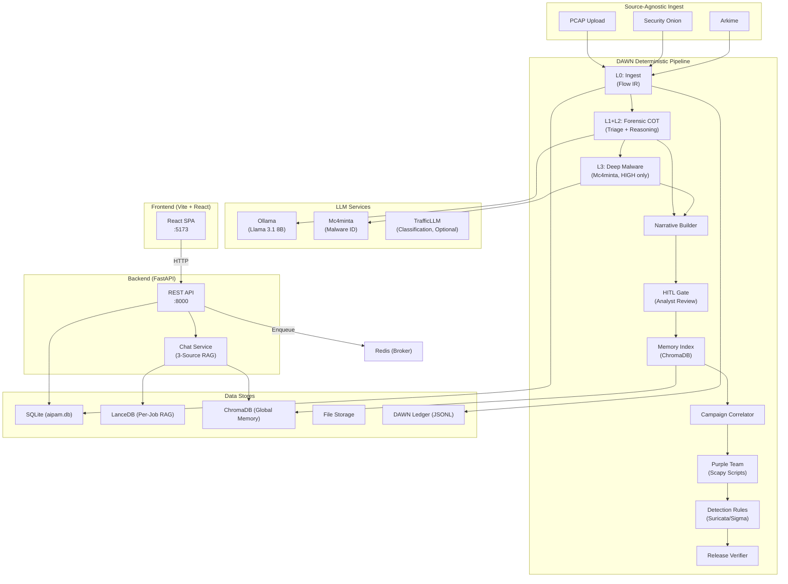

# AIPAM — Architecture Overview

> **AI PCAP Analysis Module** — A Tiered Specialist Platform for automated forensic analysis of network traffic using DAWN-orchestrated, LLM-driven reasoning with MITRE ATT&CK mapping and proactive defense capabilities.

---

## High-Level Architecture

> **Current Runtime vs. Target DAWN**  
> The diagrams below describe the intended DAWN-centric architecture. In the
> current runtime implementation, the analysis pipeline is executed via Celery
> tasks (`backend/app/tasks.py` and `backend/app/pipeline.py`). DAWN links are
> only invoked in limited API paths (e.g., simulation generation), and the
> full `aipam_forensic.yaml` pipeline is not present in this repo.

---

## The DAWN Pipeline

AIPAM executes through a **Deterministic Auditable Workflow Network**. The pipeline contract is defined in `aipam_forensic.yaml` and enforces:

- **Immutable Ledger**: JSONL audit trail of every model decision
- **Cryptographic Binding**: Findings locked to PCAP's SHA256 hash
- **Sensitivity Routing**: LOW → L1+L2 only; HIGH → L1+L2+L3

### Pipeline Stages (11 Links)

| # | DAWN Link | Sensitivity | Purpose |
|---|-----------|-------------|---------|
| 0 | `aipam.ingest.pcap` | All | Source-agnostic PCAP → unified Flow IR |
| 1-2 | `analyze.forensic_cot` | All | L1 Triage + L2 Chain-of-Thought reasoning |
| 3 | `analyze.deep_malware` | **HIGH only** | L3 Mc4minta malware family identification |
| 4 | `report.narrative` | All | LLM-synthesized forensic storyline |
| 5 | `hitl.findings_review` | All | Human-in-the-loop analyst review gate |
| 6 | `memory.vector_index` | All | Global ChromaDB forensic memory indexing |
| 7 | `correlate.campaign` | All | Cross-project campaign correlation |
| 8 | `simulate.traffic_pattern` | All | Purple Team Scapy script generation |
| 9 | `export.detection_rules` | All | Suricata + Sigma rule generation |
| 10 | `quality.release_verifier` | All | Trust receipt and final audit |

---

## System Components

### 1. Frontend — `frontend/`
| Aspect | Detail |
|--------|--------|
| Framework | Vite + React + TypeScript |
| Styling | TailwindCSS |
| Entry | `src/App.tsx` → `src/pages/` |
| API Client | `src/api.ts` (typed fetch wrapper) |
| Port | `:5173` (dev) / `:80` (production via Nginx) |

**Pages**: Dashboard (job list), Job Detail (results + findings + simulation download), Chat (3-source RAG), Settings (model configuration).

---

### 2. Backend API — `backend/app/main.py`
| Aspect | Detail |
|--------|--------|
| Framework | FastAPI (async) |
| Port | `:8000` |
| Auth | None (internal network expected) |

**Endpoint Groups** (35+ endpoints):

| Group | Prefix | Purpose |
|-------|--------|---------|
| Jobs | `/jobs` | CRUD, upload PCAPs, trigger analysis |
| Status | `/jobs/{id}/status` | Pipeline progress polling |
| Results | `/jobs/{id}/result` | Final analysis results |
| Chat | `/jobs/{id}/chat` | 3-source RAG-powered Q&A |
| Findings | `/jobs/{id}/findings` | Per-finding CRUD + analyst verdicts |
| Simulation | `/jobs/{id}/simulation` | Purple Team script generation |
| Correlations | `/correlations` | Cross-job campaign detection |
| Export Rules | `/findings/{id}/export` | Suricata/Sigma rule generation |
| Settings | `/settings` | Runtime configuration |
| Health | `/healthz` | Liveness probe |

---

### 3. Data Stores

#### SQLite (`aipam.db`)
- 11+ tables via SQLModel
- Persisted at `/data/aipam.db` inside Docker

#### LanceDB (Per-Job RAG)
- Sentence-Transformer embeddings (`all-MiniLM-L6-v2`)
- Per-job tables for isolated in-job analyst queries (runtime implementation)

#### ChromaDB (Global Forensic Memory)
- Persistent at `~/.aipam/forensic_memory`
- Cross-case forensic context for institutional memory

#### DAWN Ledger
- JSONL audit trail at project level
- Cryptographic binding via `bundle_sha256`

#### DAWN Training Ledger (Phase 6.1+)
- Immutable JSONL at `finetuning/dawn_training_ledger.jsonl`
- SHA-256 config hashes for training reproducibility
- Logs ORPO, distillation, and LocFT training events

---

### 4. The Specialist Pyramid

| Level | Model | Role | When |
|-------|-------|------|------|
| L1 | Llama 3.1 8B | Triage, UI, reports, chatbot | Always |
| L2 | Llama 3.1 8B (forensic prompt) | Chain-of-Thought reasoning, MITRE mapping | Always |
| L3 | Mc4minta | Deep malware family identification | HIGH sensitivity only |
| L2-Edge | Llama 3.2 1B (distilled) | Edge-sensor forensic reasoning (Phase 6.3) | Edge deployment |
| Legacy | TrafficLLM (ChatGLM2-6B + LoRA) | Packet-level classification (optional) | When GPU available |

#### Self-Healing Loop (Phase 6.4+6.5)

The Specialist Pyramid is continuously improved via a closed-loop training cycle:

1. **Verify** — `verify_model_bias.py` detects failing malware families
2. **Augment** — `purple_team_augment.py` generates synthetic PCAPs for failures
3. **Buffer** — Breadth-first gate requires ≥3 distinct families before training
4. **Train** — `finetune_llama_orpo.py --locft-mode` applies surgical LoRA delta (down_proj only, layers 16–30)
5. **Re-verify** — Confirm improvements without regression

See `run_v6_self_heal.sh` for the full orchestration.

---

### 5. Actionable Outputs

| Capability | How |
|------------|-----|
| **Detection Rules** | Suricata/Sigma rules from confirmed findings |
| **Purple Team Scripts** | Scapy-based adversary emulation (MITRE-mapped) |
| **Forensic Reports** | Markdown + HTML with MITRE ATT&CK mapping |
| **Campaign Intelligence** | Cross-job correlation groups |
| **Forensic Memory** | Historical case context via ChromaDB |

---

## Configuration

Settings resolved in priority order:
1. **SettingsDB** row (persisted via `/settings` API)
2. **Environment variables** (set in `docker-compose.yml` or `.env`)
3. **Hard-coded defaults** (in `settings_runtime.py`)

---

## Technology Stack Summary

| Layer | Technology |
|-------|-----------|
| Frontend | Vite, React, TypeScript, TailwindCSS |
| API | FastAPI (Python 3.11+) |
| Task Queue | Celery 5 + Redis 7 |
| Database | SQLite via SQLModel/SQLAlchemy |
| Per-Job RAG | LanceDB + sentence-transformers |
| Forensic Memory | ChromaDB |
| Pipeline | DAWN (Deterministic Auditable Workflow Network) |
| L1/L2 LLM | Ollama (Llama 3.1 8B) |
| L2-Edge LLM | Llama 3.2 1B (distilled, Phase 6.3) |
| L3 LLM | Mc4minta (malware specialist) |
| Classification | TrafficLLM (ChatGLM2-6B + LoRA, optional) |
| Fine-Tuning | Unsloth + ORPO + LocFT (Phase 6.1–6.5) |
| Network Tools | Zeek, Suricata, Scapy |
| Containerization | Docker Compose |
| PCAP Sources | Security Onion, Arkime, Direct Upload |
