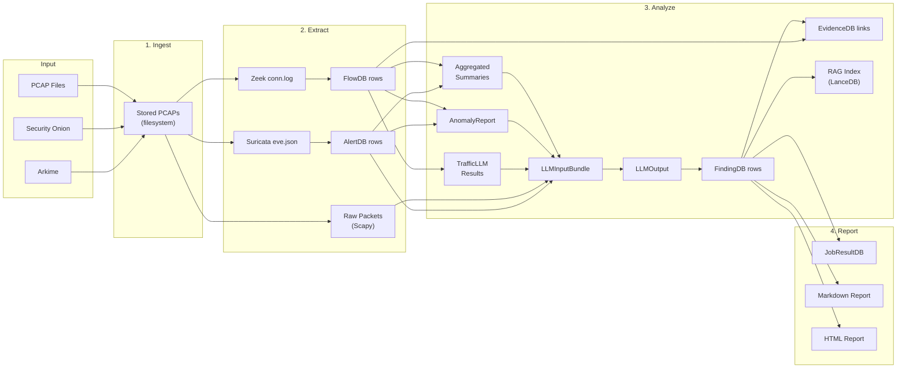

# AIPAM — Dataflow Transactions & Artifact Lifecycle

> Traces every data transformation from raw PCAP bytes to final report, documenting how artifacts are created, consumed, and persisted across the pipeline.

---

## End-to-End Dataflow



---

## Transaction Details by Stage

### Transaction 1: PCAP Acquisition

```
Trigger:    POST /jobs/upload  OR  POST /jobs/security-onion  OR  POST /jobs/arkime
Input:      Raw PCAP bytes (upload) | time_range + sensors (SO) | filter expression (Arkime)
Process:    Connector resolves and downloads PCAP files
Output:     Files saved to {FILE_STORAGE_PATH}/{job_id}/
Persisted:  JobDB (status=running), JobStepDB (ingest=running)
Checkpoint: PipelineCheckpointDB { step_name: "ingest", state_data: { pcap_paths: [...] } }
```

| Input | Output | Persistence |
|-------|--------|-------------|
| PCAP bytes | Filesystem files | `{FILE_STORAGE_PATH}/{job_id}/*.pcap` |
| Job params | JobDB row | SQLite `jobdb` |
| — | Step rows | SQLite `jobstepdb` (4 rows created) |
| PCAP paths | Checkpoint | SQLite `pipelinecheckpointdb` |

---

### Transaction 2: Feature Extraction

```
Trigger:    Completion of Stage 1 (chained task)
Input:      PCAP file paths from checkpoint
Process:    Zeek → parse conn.log; Suricata → parse eve.json; Scapy → raw packets
Output:     FlowDB rows, AlertDB rows, raw packet strings
Persisted:  FlowDB, AlertDB
Checkpoint: PipelineCheckpointDB { step_name: "extract", state_data: { flow_ids, alert_ids } }
```

**Key Transformations**:

| From | Transformer | To |
|------|-------------|---|
| PCAP file | Zeek binary | `conn.log` (JSON) |
| `conn.log` | `parsers.parse_zeek_conn_log()` | `List[FlowRecord]` |
| `List[FlowRecord]` | `evidence_store.persist_flows()` | `FlowDB` rows |
| PCAP file | Suricata binary | `eve.json` |
| `eve.json` | `parsers.parse_suricata_eve()` | `List[AlertRecord]` |
| `List[AlertRecord]` | `evidence_store.persist_alerts()` | `AlertDB` rows |
| PCAP file | Scapy | `List[str]` (packet fields) |

**ID Generation**:
- FlowDB ID: `{job_id}:{zeek_uid}` — ensures cross-job uniqueness
- AlertDB ID: `{job_id}:{alert_id}` — same pattern
- AlertDB.flow_id: `{job_id}:{alert.flow_id}` — enables join with FlowDB

---

### Transaction 3: Traffic Analysis

This is the most complex stage with multiple parallel data streams converging.

```
Trigger:    Completion of Stage 2
Input:      FlowDB + AlertDB rows for this job
Output:     FindingDB rows, EvidenceDB links, RAG index
Persisted:  FindingDB, EvidenceDB, LanceDB table
Checkpoint: PipelineCheckpointDB { step_name: "analyze", state_data: { findings, llm_raw } }
```

#### 3a. Aggregation Sub-transaction

```
FlowDB rows ──→ aggregate_hosts() ──→ List[HostSummary]
                                       (per-host metrics: flows, bytes, protocols, DNS, alerts)

FlowDB rows ──→ aggregate_host_pairs() ──→ List[HostPairSummary]
                                            (per-pair: flow count, bytes, app protos, alerts)

HostSummary[] ──→ diff_change_summaries() ──→ List[ChangeSummary]
(baseline vs exploit)                         (metric changes, new protocols, new alerts)
```

#### 3b. Anomaly Detection Sub-transaction

```
FlowDB rows ──→ AnomalyDetector.analyze() ──→ AnomalyReport
AlertDB rows ──┘                                ├── findings: List[AnomalyFinding]
DNS queries ───┘                                ├── overall_anomaly_score: float
Payload samples ──┘                             ├── zero_day_likelihood: str
                                                └── interaction_graph: Dict
```

#### 3c. TrafficLLM Classification Sub-transaction

```
FlowDB rows ──→ _flow_to_hex() ──→ packet_hex strings
                                       │
                                       ▼
                              TrafficLLM API (/v1/chat/completions)
                                       │
                                       ▼
                              TrafficLLMResult
                                ├── malware_detections: int
                                ├── botnet_detections: int
                                ├── malware_types: List[str]
                                └── botnet_types: List[str]
```

#### 3d. LLM Analysis Sub-transaction

```
HostSummary[] ─────┐
HostPairSummary[] ─┤
ChangeSummary[] ───┤
AlertRecord[] ─────┤──→ LLMInputBundle ──→ LLMClient.analyze_chunk()
AnomalyReport ─────┤                              │
TrafficLLMResult ──┤                              ▼
raw_packets[] ─────┘                      LLM (Ollama) API
                                                  │
                                                  ▼
                                          Raw JSON/text response
                                                  │
                                       ┌──────────┴──────────┐
                                       ▼                      ▼
                               _parse_llm_json()    _parse_natural_language()
                                       │                      │
                                       └──────────┬──────────┘
                                                  ▼
                                      _refine_classification()
                                     (alerts, PCAP hints, TLS markers)
                                                  │
                                                  ▼
                                             LLMOutput
                                        ├── classification
                                        ├── overall_severity
                                        ├── attack_chain[]
                                        ├── host_findings[]
                                        ├── anomalies[]
                                        └── mitre_techniques_overall[]
```

#### 3e. Persistence Sub-transaction

```
LLMOutput ──→ Convert to FindingDB rows ──→ INSERT INTO findingdb
                     │
                     ├── cited_flow_ids ──→ FlowExistenceGuardrail ──→ validate
                     │
                     └── flow_ids ──→ link_evidence() ──→ INSERT INTO evidencedb
```

#### 3f. RAG Indexing Sub-transaction

```
JobResult ──→ build_documents_from_job_result() ──→ List[RAGDocument]
                                                         │
                   ┌─────────────────────────────────────┤
                   ▼                                     ▼
            [host summaries]                   [alert summaries]
            [finding docs]                     [flow docs]
                   │
                   ▼
         index_job_result() ──→ LanceDB table (job-specific)
                                ├── Embeddings (all-MiniLM-L6-v2)
                                └── Metadata (doc_type, severity, etc.)
```

---

### Transaction 4: Report Generation

```
Trigger:    Completion of Stage 3
Input:      FindingDB, FlowDB, AlertDB rows for this job
Output:     JobResult in JobResultDB, Markdown + HTML files
Persisted:  JobResultDB, filesystem reports
```

| From | Transformer | To |
|------|-------------|---|
| `FindingDB` rows | Aggregate | `AnalysisSummary` |
| `FindingDB` rows | Group by host | `List[HostFinding]` |
| All data | `reporting.py` | Markdown report file |
| Markdown | Conversion | HTML report file |
| All above | Serialize | `JobResult` → `JobResultDB.result` (JSON) |

---

## Post-Pipeline Transactions

### Interactive Chat Flow

```
User message ──→ ChatRequest
                      │
                      ▼
         search_job_index(query) ──→ LanceDB similarity search
                      │                      │
                      ▼                      ▼
              RAGSearchResult[]      Anomaly-score reranking
                      │
                      ▼
         Build context prompt (findings + flows + alerts)
                      │
                      ▼
              LLM (Ollama) ──→ Response with citations
                      │
                      ▼
              ChatResponse ──→ Persist to ChatMessageDB
```

### Finding Verification Flow

```
PATCH /findings/{id}/verify ──→ FindingVerifyRequest { status, notes }
                                       │
                                       ▼
                              Update FindingDB.analyst_status
                              Update FindingDB.analyst_notes
                                       │
                                       ▼
                              Response: updated FindingResponse
```

### Campaign Correlation Flow

```
GET /correlations ──→ CampaignCorrelator.correlate(session)
                              │
                              ▼
                     Load all FindingDB with mitre_technique_id
                              │
                              ▼
                     Build inverted index: (technique, IP) → [(job, finding)]
                              │
                              ▼
                     Filter: ≥2 distinct jobs per key
                              │
                              ▼
                     Emit CorrelationGroup[] with confidence scores
```

### Rule Export Flow

```
POST /findings/{id}/export/suricata ──→ Load FindingDB + EvidenceDB.snippets
                                               │
                                               ▼
                                    SuricataExporter.generate()
                                               │
                                               ▼
                                    Render suricata_export.j2 prompt
                                               │
                                               ▼
                                    LLM generates Suricata rule
                                               │
                                               ▼
                                    ExportRuleResponse { rule_text }
```

### Self-Healing Training Loop (Phase 6.4+6.5)

```
Trigger:    Scheduled or manual invocation of run_v6_self_heal.sh
Input:      Deployed v6 model + validation dataset
Output:     v6-delta LoRA adapter (if failures detected)
Persisted:  dawn_training_ledger.jsonl, LoRA adapter weights
```

| Step | From | Transformer | To |
|------|------|-------------|---|
| 1 | Deployed model + validation data | `verify_model_bias.py` | Failing family list |
| 2 | Failing families | `purple_team_augment.py` | Synthetic PCAP variants |
| 3 | Synthetic PCAPs | `process_data.py` | Training-ready JSONL |
| 4 | Breadth-first buffer check | `run_v6_self_heal.sh` | ≥3 families gate |
| 5 | JSONL + v6 base | `finetune_llama_orpo.py --locft-mode` | v6-delta LoRA adapter |
| 6 | v6-delta adapter | `verify_model_bias.py` | Post-training validation |

**Key Constraint**: Step 5 applies LocFT — only `down_proj` matrices in layers 16–30 are updated. Grammar layers are frozen.

**Artifacts Produced**:
- `dawn_training_ledger.jsonl` — Immutable training event log with SHA-256 config hash
- `models/v6-delta/` — Merged LoRA adapter weights
- Verification report — Per-family accuracy + Reasoning Entropy score

---

## Artifact Lifecycle Summary

| Artifact | Created | Consumed By | Storage | Lifetime |
|----------|---------|-------------|---------|----------|
| PCAP files | Ingest | Extract | Filesystem | Permanent |
| Zeek conn.log | Extract | Extract (parser) | Temp | Transient |
| Suricata eve.json | Extract | Extract (parser) | Temp | Transient |
| `FlowDB` rows | Extract | Analyze, Report, Chat, Correlation | SQLite | Permanent |
| `AlertDB` rows | Extract | Analyze, Report, Chat | SQLite | Permanent |
| Raw packet samples | Extract | LLM prompt | In-memory | Transient |
| `HostSummary` | Analyze | LLM prompt | In-memory | Transient |
| `HostPairSummary` | Analyze | LLM prompt | In-memory | Transient |
| `ChangeSummary` | Analyze | LLM prompt | In-memory | Transient |
| `AnomalyReport` | Analyze | LLM prompt | In-memory | Transient |
| `TrafficLLMResult` | Analyze | LLM prompt | In-memory | Transient |
| `LLMInputBundle` | Analyze | LLM API call | In-memory | Transient |
| `LLMOutput` | Analyze | Finding creation | In-memory + checkpoint | Checkpointed |
| `FindingDB` rows | Analyze | Report, Chat, Correlation, Export | SQLite | Permanent |
| `EvidenceDB` links | Analyze | Chat, Export | SQLite | Permanent |
| RAG index | Analyze | Chat | LanceDB | Permanent |
| Markdown report | Report | UI download | Filesystem | Permanent |
| HTML report | Report | UI embed | Filesystem | Permanent |
| `JobResultDB` | Report | UI display | SQLite | Permanent |
| `ChatMessageDB` | Chat | Chat history | SQLite | Permanent |
| Suricata/Sigma rules | Export | External IDS | API response | Transient |
| `CorrelationGroup` | Correlation | UI display | Computed on-demand | Transient |
| `PipelineCheckpointDB` | Each stage | Retry logic | SQLite | Until deletion |
| Synthetic PCAPs | Self-heal (6.4) | Training pipeline | Filesystem | Until training |
| Training JSONL | Self-heal (6.4) | LocFT fine-tuning | Filesystem | Permanent |
| LoRA delta adapter | Self-heal (6.5) | Model merge | Filesystem | Permanent |
| `dawn_training_ledger.jsonl` | Training (6.1+) | Audit, reproducibility | JSONL file | Permanent |

---

## Data Provenance Chain

Every finding traces back to raw evidence through a chain of references:

```
PCAP file
  └─→ FlowDB row (id = {job_id}:{zeek_uid})
        └─→ EvidenceDB link (flow_id → finding_id, relationship = "supports")
              └─→ FindingDB row (mitre_technique_id, evidence, affected_hosts)
                    └─→ JobResultDB (aggregated summary)
                          └─→ Report files (Markdown + HTML)
```

This provenance chain enables:
- **Forward tracing**: "Which findings did this flow contribute to?"
- **Backward tracing**: "Which raw flows support this finding?"
- **Cross-job linking**: "Which other jobs detected this same technique on this IP?"
