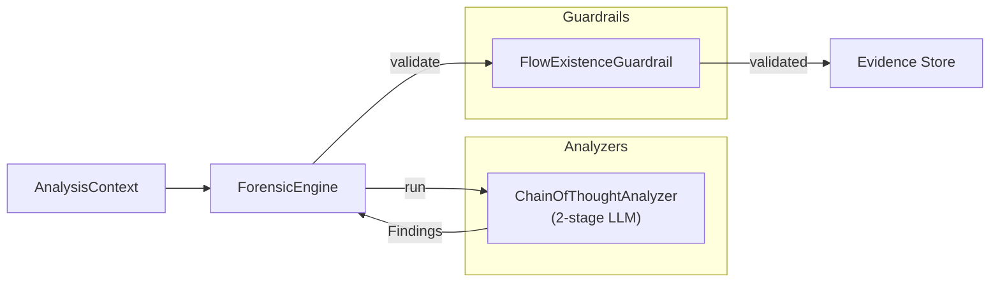

# AIPAM — Pipeline Logic & Execution Flow

> Complete documentation of the analysis pipeline, from PCAP ingestion through final report generation.

---

## Pipeline Overview

### Current Runtime (Celery)

In the current codebase, AIPAM runs a Celery-based pipeline. The API triggers
`run_pipeline()` in `backend/app/tasks.py`. A decoupled chain exists in
`backend/app/pipeline.py`, but it is not the default entry path.

### Architectural Variant (DAWN)

Documentation elsewhere references a DAWN pipeline (`aipam_forensic.yaml`) and
link-based execution. That pipeline contract is not present in this repo and is
not currently invoked by the main analysis endpoints.

---

AIPAM runs two pipeline implementations depending on the execution context:

| Pipeline | File | Stages | Orchestration |
|----------|------|--------|---------------|
| **Monolithic** | `tasks.py` → `run_pipeline()` | 5 logical steps | Single Celery task |
| **Decoupled** | `pipeline.py` | 4 chained tasks | `celery.chain()` |

Both pipelines share the same logical flow, checkpointing system, and data models.

---

## Execution Flow

```mermaid
flowchart TD
    START["Job Created<br/>(API Request)"] --> INGEST

    subgraph INGEST["Stage 1: Ingest PCAP"]
        I1["Resolve data source<br/>(Upload / SecOnion / Arkime)"]
        I2["Save PCAP files to storage"]
        I3["Checkpoint: pcap_paths"]
    end

    INGEST --> EXTRACT

    subgraph EXTRACT["Stage 2: Extract Features"]
        E1["Run Zeek → conn.log JSON"]
        E2["Run Suricata → eve.json"]
        E3["Extract raw packets (Scapy)"]
        E4["Parse into FlowRecord / AlertRecord"]
        E5["Persist to FlowDB / AlertDB"]
        E6["Checkpoint: flow_ids, alert_ids"]
    end

    EXTRACT --> ANALYZE

    subgraph ANALYZE["Stage 3: Analyze Traffic"]
        A1["Build LLMInputBundle"]
        A2["Aggregate host & host-pair summaries"]
        A3["Diff baseline vs exploit (if applicable)"]
        A4["Run AnomalyDetector (10 heuristics)"]
        A5["Classify flows via TrafficLLM (optional)"]
        A6["Send to Ollama LLM for forensic analysis"]
        A7["Parse LLMOutput → Findings"]
        A8["Apply guardrails (FlowExistenceGuardrail)"]
        A9["Persist to FindingDB + EvidenceDB"]
        A10["Build RAG index (LanceDB)"]
        A11["Checkpoint: findings, llm_raw"]
    end

    ANALYZE --> REPORT

    subgraph REPORT["Stage 4: Generate Report"]
        R1["Load findings, flows, alerts from DB"]
        R2["Build AnalysisSummary"]
        R3["Generate Markdown report"]
        R4["Generate HTML report"]
        R5["Store JobResult in JobResultDB"]
        R6["Set job status → COMPLETED"]
    end
```



---

## Stage Details

### Stage 1: Ingest PCAP

**Purpose**: Acquire PCAP files from any supported data source.

**Data Sources**:
| Source | Handler | Input |
|--------|---------|-------|
| Direct Upload | `create_job_upload()` | `multipart/form-data` PCAP files |
| Security Onion | `SecurityOnionConnector` | Time range + sensor filters |
| Arkime | `ArkimeConnector` | Session filter expression |

**Process**:
1. Create `JobDB` row (status: `QUEUED`)
2. Create `JobStepDB` rows for each pipeline step
3. Resolve PCAP files from the appropriate connector
4. Save PCAPs to `{FILE_STORAGE_PATH}/{job_id}/`
5. Save checkpoint with PCAP paths

**Output**: List of filesystem paths to PCAP files.

---

### Stage 2: Extract Features

**Purpose**: Run network analysis tools on PCAPs and populate the evidence database.

**Tools Used**:
| Tool | Output | Parser |
|------|--------|--------|
| **Zeek** | `conn.log` (JSON) | `parsers.parse_zeek_conn_log()` |
| **Suricata** | `eve.json` | `parsers.parse_suricata_eve()` |
| **Scapy** | Raw packet fields | `_extract_raw_packets()` |

**Process**:
1. Run Zeek on each PCAP → parse `conn.log` into `FlowRecord` objects
2. Run Suricata on each PCAP → parse `eve.json` into `AlertRecord` objects
3. Extract raw packet samples via Scapy (up to 50 packets, skipping DHCP/ARP)
4. Persist flows to `FlowDB` and alerts to `AlertDB` via `EvidenceStore`
5. Save checkpoint

**Output**: Populated `FlowDB` and `AlertDB` tables for the job.

---

### Stage 3: Analyze Traffic

**Purpose**: Apply AI/ML analysis to extracted features, producing forensic findings.

#### 3a. Aggregation (`aggregation.py`)
- **Per-host summaries**: Total flows, bytes, protocols, DNS stats, alerts per `HostSummary`
- **Host-pair summaries**: Communication patterns between IP pairs per `HostPairSummary`
- **Change summaries**: Baseline vs exploit diff (for `baseline_vs_exploit` mode) per `ChangeSummary`

#### 3b. Anomaly Detection (`anomaly_detector.py`)
10 heuristic detectors run in parallel:

| # | Detector | Detects |
|---|----------|---------|
| 1 | `_detect_beacon_patterns` | C2 beacon intervals (low jitter) |
| 2 | `_detect_volume_anomalies` | Data exfiltration patterns |
| 3 | `_detect_connection_anomalies` | Unusual port/protocol combos |
| 4 | `_detect_port_scanning` | Single source scanning many ports |
| 5 | `_detect_lateral_movement` | Internal host-to-host spreading |
| 6 | `_detect_temporal_anomalies` | Off-hours activity, traffic bursts |
| 7 | `_detect_dns_anomalies` | DGA domains, DNS tunneling |
| 8 | `_detect_dns_beaconing` | Periodic DNS queries (C2 over DNS) |
| 9 | `_detect_tls_anomalies` | Suspicious TLS on non-standard ports |
| 10 | `_detect_entropy_anomalies` | High-entropy payloads |
| + | `_detect_graph_anomalies` | Network topology (hubs, pivots) |

Produces an `AnomalyReport` with findings, overall score, and zero-day likelihood.

#### 3c. TrafficLLM Classification (optional, `tasks.py`)
- Classifies up to 50 flows using TrafficLLM
- Tasks: MTD (malware), EVD (VPN), TBD (Tor), BND (botnet), WAD (web attack), AAD (APT)
- Results feed into the `LLMInputBundle`

#### 3d. LLM Forensic Analysis (`llm_client.py`)
1. Build `LLMInputBundle` with all aggregated data
2. Format data in the fine-tuned model's expected `<packet>: ...` format
3. Send to Ollama via OpenAI-compatible API
4. Parse response: try JSON first, fall back to natural language parsing
5. Refine classification using alert metadata, PCAP filename hints, TLS markers
6. Validate into `LLMOutput` (attack chain, host findings, anomalies, MITRE techniques)

#### 3e. Guardrails (`core/guardrails.py`)
- `FlowExistenceGuardrail`: Verifies cited flow IDs exist in `FlowDB`
- Flags hallucinated references with `requires_review = True`
- Fail-open: skips validation if no DB session available

#### 3f. Evidence Linking
- Each finding is linked to supporting flows via `EvidenceDB`
- Enables "which flows prove this finding?" queries

---

### Stage 4: Generate Report

**Purpose**: Compile findings into human-readable reports.

**Process**:
1. Load all `FindingDB` rows for the job
2. Build `AnalysisSummary` (classification, severity, key findings, MITRE techniques)
3. Build `HostFinding` list (per-host role + findings)
4. Generate Markdown report → save to `{reports_path}/{job_id}.md`
5. Generate HTML report → save to `{reports_path}/{job_id}.html`
6. Persist `JobResult` to `JobResultDB`
7. Update `JobDB.status` → `COMPLETED`

---

## Analysis Modes

| Mode | Description | Aggregation |
|------|-------------|-------------|
| `baseline_vs_exploit` | Compares normal traffic against attack traffic | Diff-based `ChangeSummary` |
| `single_window` | Analyzes a single time window | Direct aggregation only |

---

## Checkpointing & Retry

Each pipeline stage saves its output as a `PipelineCheckpointDB` row:

```
{job_id}:ingest     → { pcap_paths: [...] }
{job_id}:extract    → { flow_ids: [...], alert_ids: [...] }
{job_id}:analyze    → { findings: [...], llm_raw: {...} }
{job_id}:report     → { report_urls: {...} }
```

On retry, completed steps are skipped and their saved state is restored.

---

## Core Engine Architecture (`core/engine.py`)



The `ForensicEngine` is pluggable — analyzers and guardrails are injected at construction time.

### ChainOfThoughtAnalyzer (2-Stage LLM Reasoning)
1. **Triage**: "Which N flows are most suspicious?" → ranked flow IDs
2. **Deep Analysis**: Full forensic analysis on selected flows → `Finding` objects with MITRE mappings

---

## Interactive Chat (RAG)

After analysis completes, the RAG system enables interactive Q&A:

1. `build_documents_from_job_result()` creates `RAGDocument` chunks from findings, hosts, alerts
2. `index_job_result()` embeds and stores in LanceDB
3. `search_job_index()` performs semantic search with anomaly-score reranking
4. `ChatService` builds context from search results and sends to LLM
5. Response includes citations referencing specific findings/flows/alerts

---

## Campaign Correlation (`core/correlation.py`)

Cross-job analysis that detects shared campaigns:

1. Load all findings with MITRE technique IDs
2. Build inverted index: `(technique, IP) → [(job_id, finding_id)]`
3. Group entries spanning ≥ 2 distinct jobs
4. Emit `CorrelationGroup` with deterministic `group_id` and confidence score

---

## Rule Export (`core/exporters.py`)

Generates detection rules from confirmed findings:

| Exporter | Output | Template |
|----------|--------|----------|
| `SuricataExporter` | Suricata IDS rules | `suricata_export.j2` |
| `SigmaExporter` | Sigma YAML rules | `sigma_export.j2` |

Both use the LLM to generate context-aware rules from finding evidence.
