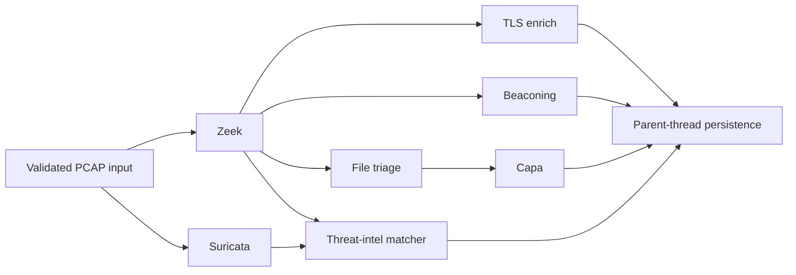

# Job runtime resilience and pipeline throughput

Status: design draft for review. The diagnostic findings and implementation direction were approved in conversation. This document fixes the contracts and rollout boundaries before application code changes.

## Purpose

Make analysis jobs observable and recoverable when workers restart, ensure cancellation and failures become durable terminal states, keep the chat page synchronized with job state, and shorten large PCAP analysis without exceeding SQLite's safe write-concurrency envelope.

The incident that triggered this work was a job left `running` after its late-acknowledged Celery task was interrupted during a container recreation. Redis retained the delivery in `unacked`, the worker did not reclaim it until the message was restored, and the database was responsive. After redelivery, per-host theory generation ran over every discovered host and eventually hit a random theory-ID collision. That flush failure left the SQLAlchemy session in rollback-required state; final status persistence reused the same session and failed, leaving the dead task represented as `running`. The design addresses each cause rather than treating the database as hung.

## Scope and constraints

- Keep Celery worker concurrency at one while AIPAM uses SQLite for the main application database.
- Use bounded concurrency inside one job only where tasks have independent inputs and output directories. Database persistence remains owned by the orchestrating thread.
- Preserve all existing terminal job states: `completed`, `completed_with_errors`, `failed`, `canceled`, and `deleted`.
- Do not automatically replay an interrupted full pipeline in this change. Several downstream operations are not yet proven idempotent. Recovery makes the interruption explicit and lets a user start a clean rerun.
- Do not terminate a running Celery process from the API. Cancellation is durable and cooperative so cleanup and database state remain consistent.
- Do not apply the legacy chat-schema repair while an analysis is actively writing the SQLite database. The operator migration runs after active jobs reach a terminal state and after a database backup.
- Preserve the existing MNEMOS comparison behavior and data. The schema repair makes the pushed feature usable against an older unversioned database.
- Preserve the repository's deterministic-execution invariant. Parallel completion timing may change operational events, but downstream evidence is merged in stable registry and record order so identical inputs retain identical analysis artifacts and `bundle_sha256` values.
- If an affected DAWN link changes an artifact schema, update its `link.yaml` producer and every downstream requirement in the same phase. AI-derived findings retain source-bundle provenance and ledger events.

## Chosen approach

Add a durable execution lease to each job. Dispatch assigns a task identity before publishing. A worker may run a job only when it owns the current identity, updates a heartbeat through a separate short-lived database session, and checks a persisted cancellation request at safe boundaries. Any escaping exception is terminalized through a fresh database session. A worker-start reconciliation pass marks expired executions as failed and clears their ownership, so a delayed Redis redelivery cannot silently restart stale work.

Inside the pipeline, execute independent sensor work concurrently with a small configurable thread pool, collect immutable results in worker threads, and persist those results in deterministic order in the parent thread. Stream high-volume sensor output into chunked bulk inserts. Generate host theories only for hosts supported by findings or alerts, preload the evidence used by those theories, and commit the theory set in batches.

Alternatives considered:

- Relying on Celery's Redis visibility timeout would eventually redeliver interrupted work, but leaves the UI stale for up to an hour and can duplicate a still-valid long task if shortened below its runtime.
- Raising Celery worker concurrency would run whole jobs in parallel, but concurrent SQLite writers would shift the bottleneck into lock contention and increase partial-state risk.
- Force-revoking tasks with `terminate=True` would stop work faster, but can kill code while it owns files, subprocesses, or a database transaction.
- Automatically replaying a stale job would improve apparent availability, but is unsafe until every destructive or append-only stage has a verified idempotency contract.

## Durable job execution contract

Add nullable execution metadata to `jobs`:

| Column | Meaning |
| --- | --- |
| `celery_task_id` | Identity of the only Celery delivery allowed to claim or continue the current execution. |
| `execution_attempt` | Monotonic counter incremented for each dispatch. |
| `run_token` | Random fencing token assigned when the worker claims the current execution. |
| `worker_id` | Diagnostic worker hostname or node name that owns the active lease. |
| `heartbeat_at` | UTC timestamp most recently renewed by the active execution. |
| `dispatched_at` | UTC timestamp written after the broker accepts the identified task. |
| `cancel_requested_at` | Durable request that active pipeline code must observe. |
| `accepted_run_manifest_json` | Ordered immutable run/phase outputs that readers are allowed to resolve for this job. |

Dispatch generates a UUID and persists `celery_task_id`, the incremented attempt, cleared cancellation metadata, and `queued` status before publishing with `apply_async(task_id=...)`. After broker acceptance, `dispatched_at` is written conditionally for that task ID whether the job is still queued or a fast worker has already claimed it.

Broker publication has an uncertain-outcome race: a broker can accept a message and the client can still observe an exception. On a publication exception, dispatch may mark the job `failed` only with a compare-and-swap requiring the same task ID, `queued` status, and `dispatched_at IS NULL`. If a worker already claimed the job, that update loses and dispatch returns the current accepted state instead of overwriting it. If the task remains queued, it receives bounded `dispatch_failed` detail and `completed_at`; an eventual accepted-but-delayed delivery sees a terminal row and becomes a no-op. A queued, undispatched row left by API process loss is handled by the same conditional rule after the dispatch grace period. This deliberately chooses a visible false failure plus explicit rerun over duplicate execution. A transactional outbox could remove that availability tradeoff, but is outside this bounded change.

The worker claim is a conditional database update. It succeeds only when the task ID matches the job's current `celery_task_id` and the job is `queued`. A delivery that finds the same task already `running` reports a busy duplicate and exits without invoking the pipeline. A late delivery whose identity was cleared or replaced also acknowledges and exits. Interrupted jobs are failed by reconciliation and require an explicit rerun; redelivery never steals or revives an execution.

After claim, the worker sets `running`, `started_at` if absent, `worker_id`, `run_token`, and `heartbeat_at`. A lightweight heartbeat thread uses its own SQLAlchemy session and updates only a row still owned by that task ID and run token. The default interval is 15 seconds. The stale threshold is configurable and must be at least four heartbeat intervals plus SQLite's busy timeout; the initial default is 120 seconds. Long subprocess stages therefore remain visibly alive without coupling liveness to stage completion.

The pipeline uses a dedicated `FencedSession` subclass for every task-owned database session. A registered `before_commit` hook issues, through the transaction's current connection, a conditional ownership update requiring the current task ID, run token, and `running` status. It writes the database's UTC time to `heartbeat_at` and requires `rowcount == 1`; otherwise it raises `JobOwnershipLost` and rolls the transaction back. This hook intercepts existing service methods that call `commit()` internally. The implementation audits and converts every secondary session opened from the worker path; an unfenced task-owned session is a test failure.

The standalone heartbeat also uses database time and the same ownership predicate. SQLite `busy`/timeout is reported as delayed liveness and retried; it is never interpreted as ownership loss. Long write transactions do not create false ownership: the reconciler and pipeline serialize on SQLite's writer lock. Once the lock is available, the first conditional update decides the state; a later update with the old token cannot commit. The fence prevents a worker that resumes after lease loss from publishing database results or overwriting a terminal status.

Task-owned filesystem work is isolated under an immutable run-specific directory. There is no check-then-rename promotion. Every artifact reader resolves only the ordered run tokens in `accepted_run_manifest_json`; it never scans run directories. The owned finalization transaction conditionally verifies task ID, run token, and `running` status, then updates the accepted manifest and terminal job state in the same SQLite commit. A full run selects its own manifest; phase reanalysis appends or replaces the matching phase entry while retaining accepted earlier phases. If finalization loses ownership, its directory remains unreferenced and cannot become evidence. This database pointer avoids a cross-filesystem/database atomicity gap.

Ownership loss sets a process-local event, stops new scheduler submissions, terminates and reaps supervised subprocesses/containers, and prevents any accepted-manifest update. Unreferenced run data is retained for bounded diagnostics and removed by cleanup.

The worker wrapper catches every ordinary exception, rolls back and closes its working session, and uses a new session to transition the still-owned job to `failed`. The stored error is a stable category plus a bounded message; stack traces remain in logs. If cancellation is already requested, terminalization resolves to `canceled`. Hard process loss is handled by reconciliation. The wrapper emits the terminal event only after the fresh-session database commit.

Worker startup invokes reconciliation, and a small runtime-supervisor process repeats it on a configurable interval so liveness does not depend on a worker restart or a browser request. It considers only `running` jobs whose `heartbeat_at` is older than the stale threshold, or legacy running rows with no heartbeat older than that threshold from `started_at`. It marks them `failed` with `interrupted_by_worker_loss`, sets `completed_at`, and clears active ownership. A stale `canceling` job becomes `canceled`. It does not change healthy running jobs or terminal jobs. Queued rows assigned a task ID but never marked dispatched are failed after a separate dispatch grace period. The same function is exposed as an operator command and is idempotent.

Celery retains late acknowledgement and prefetch one. Add `task_reject_on_worker_lost=True`. Set Redis visibility timeout above the documented maximum supported job runtime; it is a broker safety net rather than the primary liveness detector.

## State transitions and cancellation

Allowed execution transitions for this change are:

```text
queued  -> running -> completed
                 \-> completed_with_errors
                 \-> failed
                 \-> canceling -> canceled
queued  ----------------> failed      (dispatch failure)
queued  ----------------> canceled    (cancel before claim)
running ----------------> failed      (stale lease reconciliation)
```

Add `canceling` as a public active job status. `POST /jobs/{job_id}/cancel` atomically sets `cancel_requested_at`. For a queued task it transitions immediately to `canceled`, clears ownership, and lets any already-published delivery be consumed as a terminal no-op. For a running task it changes status to `canceling`; the worker transitions it to `canceled` after reaching a safe checkpoint. The response therefore shows “Cancellation requested” without claiming that work has stopped. Repeated cancel calls are idempotent while a request is pending or the job is canceled.

The orchestrator receives a small `ExecutionControl` interface with `heartbeat()`, `raise_if_cancelled()`, and the shared stop event used by sensor supervisors. It checks before and after every stage, before database-heavy loops, between correlation chunks, between theory batches, and while supervising external subprocesses. Cancellation raises a dedicated exception handled only by the worker boundary. Completed terminal state cannot overwrite canceled state because every final status update includes the current task identity and cancellation check.

Cancellation has a configured service objective: cooperative code must stop within 30 seconds, and no checkpoint interval may exceed that value. Before this acceptance criterion can pass, every potentially blocking handler must either use the existing supervised subprocess/container boundary or prove bounded calls and checkpoints inside its record/file loop. At 60 seconds, the runtime supervisor escalates an unresponsive task by terminating the Celery child process, then reaps run-labelled subprocesses/containers and finalizes the still-owned row as `canceled` through a fresh session. The API itself never force-terminates a worker.

## Chat page state synchronization

`ChatPage` polls `GET /jobs/{id}` every two seconds while the job is `queued`, `running`, `canceling`, or `deleting`, then stops when any terminal status arrives. This uses the same React Query key as other job views so cache updates remain consistent. Polling is preferred here because the page currently has no job-event subscription and the status endpoint is small; it also recovers naturally after a missed event or browser sleep.

Chat becomes available only for `completed` and `completed_with_errors`. Conversation and knowledge-base hydration are disabled until one of those states arrives, avoiding unrelated API calls while analysis is active or failed. Failed and canceled jobs render their terminal status and the bounded error summary instead of the perpetual “available after analysis completes” message. A `canceling` job renders “Cancellation requested.” The MNEMOS toggle and comparison pane remain inside the successful-terminal view.

## Bounded pipeline scheduling

The orchestrator uses a dependency graph rather than one linear sensor list:



Zeek and Suricata run together because they read the same immutable PCAP inputs and write separate stage directories. After both settle, ready sensors run in bounded layers. The default in-job parallelism is two and is capped by `AIPAM_SENSOR_PARALLELISM`. A sensor starts only after every declared dependency succeeded, unless its existing definition explicitly permits degraded inputs. Failed, skipped, timed-out, and canceled results remain distinct.

Worker threads never share the orchestrator's SQLAlchemy session or Docker client. They return `SensorResult` values. The parent thread sorts persisted results and all downstream inputs by stable registry order, writes `JobSensor` rows, publishes events, and advances the dependency graph. This keeps database writes serialized and evidence artifacts deterministic even when completion events arrive in a different real-time order.

The first implementation applies timeouts to both container-backed and in-process sensor handlers. Cooperative cancellation is checked by the supervisor loop. A timed-out in-process Python handler cannot be safely killed by a thread; handlers that can exceed their budget must run in a subprocess. The implementation inventory will move any such handler behind the existing subprocess/container boundary rather than pretending a thread timeout stopped it.

## Correlation memory and write behavior

Correlation reads normalized JSONL records as iterators instead of materializing all sensor outputs and all ORM objects at once. Each record is normalized, contributes to compact host, signature, and IOC accumulators, and is appended to typed insert mappings. Mappings are written with SQLAlchemy Core bulk inserts in configurable chunks, initially 2,000 rows. The parent transaction remains the sole SQLite writer for this stage.

Chunking controls Python memory, but the whole correlation stage uses one transaction so cancellation or failure cannot expose partial results. A small correlation receipt records `(job_id, correlator_version, input_fingerprint)` and final counts in that same transaction. The fingerprint covers sorted sensor-result file content and the phase label. An identical successful replay becomes a no-op; a failed attempt rolls back both rows and receipt. Changed-input reanalysis retains the current additive behavior because replacing overlapping historical results safely requires row-level run provenance outside this change.

Host aggregation keeps one compact record per IP, which is necessary for host summaries. Timeline and evidence rows keep existing filtering and provenance semantics. Counts returned by `correlate_job` must match persisted row counts after commit. Performance tests use generated JSONL fixtures large enough to prove bounded batch size and no semantic count regression without requiring a production PCAP.

## Relevant-host theory generation

Job-level theories continue to run. Host-level theories are generated only for hosts that have findings, alerts, IOCs, or corroborated/confirmed telemetry associated with their IP. A host discovered only in benign connection metadata is not a theory scope. This rule is evidence-based and has no arbitrary top-N cap.

The theory service performs set-based queries to obtain relevant host IDs, then preloads the alerts, findings, IOCs, corroborated events, and host facts required by all selected scopes. It applies the phase label consistently to every evidence family. Each generator branch supplies a stable semantic `theory_key`; identifiers use a full deterministic UUID derived from job, phase, scope type, scope ID, and that key. Candidate position and mutable score/content are excluded. The current eight-hex random suffix is removed because its collision space is too small at large host counts. Regeneration upserts those stable identities and preserves analyst-owned review fields while replacing generated scoring and evidence fields.

It builds theories without committing inside each host call. New and updated theory rows are flushed in batches, initially 100 scopes, with heartbeat and cancellation checks between batches. One final commit makes the stage visible atomically. Any flush failure rolls back the theory transaction before the worker uses a fresh session for terminal job status. If SQLite limits require smaller transactions, the batch transaction choice must be documented and every visible batch must still use stable upsert identities.

Metrics record discovered host count, relevant host count, theory scope count, duration, and skipped benign host count. These values make the performance improvement reviewable and show when an unexpectedly broad evidence rule reappears.

## Error and partial-success semantics

Every stage produces one of `completed`, `failed`, `timeout`, `skipped`, or `canceled`. Required stage failure makes the job `failed`. Optional sensor or enrichment failure makes the job `completed_with_errors`. The final status derives from both stage and sensor outcomes; caught exceptions may not result in plain `completed`.

Frontier distillation and other external enrichment that is not required for core job results moves after the terminal analysis commit or into a separate task with its own status. It cannot hold the job in `running` for repeated network timeouts. Its failure is visible in metrics/logs and does not rewrite a completed analysis job.

## Legacy SQLite migration and startup behavior

The current database predates Alembic tracking. `Base.metadata.create_all()` created new tables but could not add the new MNEMOS comparison columns to existing `chat_conversations`; startup then swallowed the schema error. This design removes silent schema initialization failure.

Add an explicit migration command used before API and worker startup. The current Alembic head is `7a4d8e2c9b10`; the new migration extends that chain. Its legacy bootstrap path:

1. Run as a one-shot Compose init service before API, worker, and runtime supervisor. Acquire an exclusive migration lock and refuse to continue while any job is `queued`, `running`, `canceling`, or `deleting`.
2. Checkpoint the WAL, create a timestamped immutable backup and a separate migration candidate using the SQLite backup API, and run `PRAGMA quick_check` on all three.
3. Inspect a strict fingerprint of required legacy core tables and columns. Unknown layouts fail closed with an operator message.
4. If `alembic_version` is absent and the fingerprint matches the supported legacy schema, remove only empty, known auto-created comparison tables from the candidate when they conflict with the migration, stamp the verified baseline revision, and run Alembic to head on the candidate.
5. If any conflicting table contains rows, abort without changing it. Never infer that data can be discarded.
6. Verify required columns, foreign keys, indexes, triggers, row-count/data invariants, and Alembic head on the candidate. Only then replace the stopped source database with the candidate on the same filesystem. Retain the backup and write a migration receipt containing checksums and sanitized validation results. On failure, leave the source untouched and prevent application startup.

Fresh databases are created by `alembic upgrade head`. `create_all()` remains available only to isolated tests that intentionally construct metadata. API and worker startup must surface migration errors and must not continue against an incompatible schema.

The first live rollout runs the migration manually only after every active analysis reaches a terminal state, validates chat comparison endpoints, and only then enables the automatic pre-start command in Compose. Rollback stops all writers, verifies the retained backup checksum, restores it on the same filesystem, and starts the previous application image. This separates code deployment from the one-time legacy conversion and provides a clear recovery point.

## Implementation phases

1. Add the execution metadata migration, conditional claim, heartbeat service, terminal exception boundary, startup reconciliation, and dispatch failure handling.
2. Add durable cooperative cancellation and active-job polling/terminal UI states.
3. Refactor relevant-host theory generation and chunked correlation with semantic and performance regression tests.
4. Add bounded dependency-aware stage and sensor scheduling, keeping all database writes in the parent thread.
5. Add the legacy bootstrap migration command and fixture-based migration tests.
6. After the live job is terminal, back up and migrate the live SQLite database, rebuild only the affected services, and validate job lifecycle plus baseline/MNEMOS chat in the browser.

Each phase uses test-first changes and a separate specification-compliance and code-quality review before integration.

## Acceptance criteria

1. Killing and recreating a worker causes an expired running lease to become `failed` with `interrupted_by_worker_loss` within the configured stale window; delayed delivery of its old task ID exits without rerunning the pipeline. A resumed old worker cannot commit database state, enter the accepted run manifest, or leave supervised children running. Readers never expose an unreferenced run directory.
2. Any uncaught pipeline exception rolls back the task session and leaves the job in `failed` with `completed_at` through a fresh session; no tested exception path, including a flush failure, leaves `running` indefinitely. Every worker-path commit is intercepted by the ownership fence.
3. Broker publication failure resolves by conditional state: a still-queued undispatched task becomes durably `failed`, while a worker claim that already won remains active. Neither the synchronous failure nor the API-process-loss window leaves an indefinite queued row or starts two executions.
4. Canceling a queued job prevents execution. Canceling a running job is visible immediately, cooperatively stops within 30 seconds under supported handlers, escalates and cleans up by 60 seconds when unresponsive, and cannot later be overwritten by `completed`.
5. ChatPage updates from queued/running to a terminal state without reload. Failed and canceled jobs show the correct terminal explanation; successful jobs reveal both baseline and MNEMOS chat.
6. Zeek and Suricata overlap in a scheduler test, dependency-constrained sensors never start early, configured parallelism is respected, and result persistence remains deterministic.
7. Correlation processes a large generated input with insert batches no larger than the configured chunk, bounded object accumulation, identical persisted counts, and duplicate-safe retry behavior.
8. Host theories are generated for every host supported by findings, alerts, IOCs, or corroborated telemetry and for no connection-only host. Evidence queries and commits do not scale once per discovered host. A high-volume ID test produces no collisions, and regeneration preserves analyst review fields on stable theory identities.
9. Required stage failures yield `failed`; optional sensor/enrichment failures yield `completed_with_errors`; noncritical post-processing cannot keep core analysis `running`.
10. Worker concurrency remains one in the SQLite deployment. Configuration and operations documentation state that whole-job concurrency may increase only after the primary database moves to PostgreSQL or adopts a dedicated writer architecture.
11. The legacy migration refuses active jobs and unknown schemas, creates and verifies a backup, upgrades a representative unversioned fixture to Alembic head without losing existing chat data, and makes the MNEMOS comparison API usable.
12. Focused backend tests, frontend API/build checks, migration tests, deterministic artifact/hash checks, and a browser smoke test pass before merge. The required DAWN ledger and release verifier return `PASS`. Live rollout evidence records timestamps, job IDs, schema revision, and sanitized results.

## Review focus

- Whether marking stale executions failed, rather than automatically replaying them, is the correct safety boundary for the current non-idempotent pipeline.
- Whether relevant-host selection based on findings or alerts captures every intended host theory without an arbitrary cap.
- Whether the supported legacy schema fingerprint and baseline revision are narrow enough to avoid stamping an unknown database.
- Whether any existing in-process sensor can exceed its timeout and therefore needs process isolation before bounded parallel scheduling.
